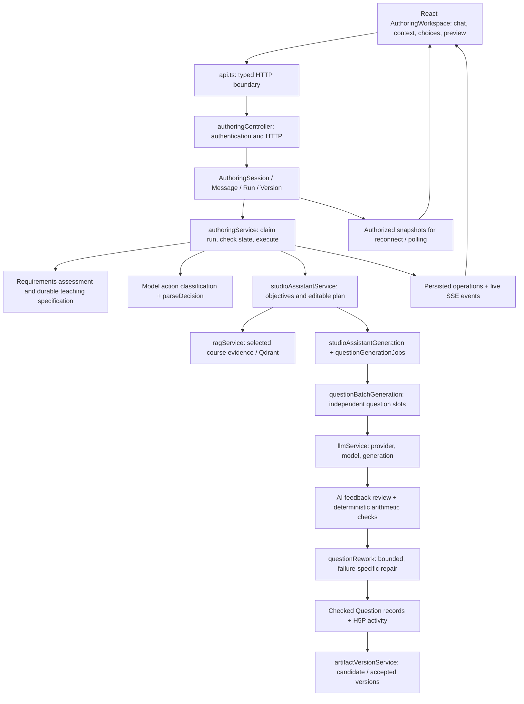

# CREATE Agent Architecture and Code Reading Guide
# CREATE Agent 架构与代码阅读指南

Updated / 更新：2026-10-01  
Scope / 范围：conversation-first H5P Studio in this working tree / 当前工作区的对话式 H5P Studio。This document describes implemented code, not a future roadmap. / 本文描述已实现的代码，不把规划当成现状。

## 1. Start with this mental model / 先建立整体概念

**EN:** CREATE is a domain-specific agent with a bounded workflow. A model interprets teaching requests, asks clarifying questions, proposes objectives and plans, and writes/reviews questions. Application code decides which actions are available, checks ownership and revisions, enforces approval, executes services, and saves results. The model does not receive arbitrary shell, database, or deployment access.

**中文：** CREATE 是一个有明确边界的教学 agent。模型理解教学需求、追问、提出 LO 和题目计划、生成和审核题目；程序负责确定允许的动作、验证权限和版本、要求用户批准、调用服务并保存结果。模型不能任意执行命令、操作数据库或发布内容。

```text
Agent = model decisions + explicit state + allowed actions + evidence
        + execution loop + validation + human decisions + saved artifacts
Agent = 模型决策 + 明确状态 + 允许的动作 + 证据
        + 执行循环 + 检查 + 人的决策 + 保存的产物
```

**EN:** Three different concepts matter: the **conversation** is long-lived; a **run** processes one command; an **operation** records an actual service action within that run. An artifact version is the saved output, not the transcript.

**中文：** 要区分三个概念：**conversation/session** 是持续的对话；**run** 处理一次用户命令；**operation** 记录这次执行中的真实服务操作。产物版本是输出内容，不是聊天记录。

## 2. Architecture map / 整体架构



**EN:** Express hosts the API and starts the authoring worker. MongoDB is the durable state store. Qdrant stores material embeddings for retrieval. H5P/Lumi renders and saves the learning activity. The frontend never receives provider secrets.

**中文：** Express 提供 API 并启动 authoring worker。MongoDB 保存持久化状态；Qdrant 存储材料向量供检索；H5P/Lumi 负责学习活动的呈现和保存。前端不应获得模型服务的密钥。

**EN:** The regular course workflow still exists: Materials → Learning Objectives → Generate Questions → Review & Edit → Coverage Map. Studio reuses those domain records and generation services. The older `StudioAssistantSession` is the planning/generation adapter underneath the newer conversation layer; it has not been replaced by a second independent quiz database. CREATE Guide is a separate product-help assistant.

**中文：** 原有课程流程仍然存在：材料 → LO → 生成题目 → 审核编辑 → Coverage Map。Studio 复用这些业务记录和服务。较早的 `StudioAssistantSession` 现在是新对话层下面的规划/生成适配层，不是另建一套题库。CREATE Guide 则是独立的产品帮助助手。

## 3. A complete request, step by step / 一次请求如何执行

Example / 示例：`Create around 15 questions for first-year mechanics students, based on the attached material.`

1. **EN:** The composer submits instructions and selected context IDs with a request ID. A text-only request is also valid; the server can supply the author's Studio drafts course as storage.
   
   **中文：** 输入框提交文字、选中的上下文 ID 和 request ID。纯文字也能开始；系统可以用该用户的 Studio drafts 课程作为存储位置。
2. **EN:** The controller authenticates the user. `createAuthoringSession()` resolves owned context, saves the initial message/specification, and enqueues a run. Replaying the same request does not create another paid task.
   
   **中文：** Controller 验证登录。`createAuthoringSession()` 验证上下文归属，保存初始消息和要求，再把 run 入队。重复提交同一个请求不会新建一次付费任务。
3. **EN:** `tickAuthoringWorker()` claims work with a lease. `perform()` checks the task state. `assessAuthoringRequirements()` asks the model whether the brief is sufficiently clear. Missing decisions become 1–3 UI questions, each with selectable options.
   
   **中文：** Worker 用租约领取任务。`perform()` 根据状态决定下一步。模型判断需求是否明确；缺少关键信息时返回 1–3 个可选择答案的 UI 问题。
4. **EN:** Once ready, the planning service reads selected material evidence, reuses referenced objectives or generates new ones, then proposes a question plan. Text-only planning does not invent source citations.
   
   **中文：** 需求明确后，读取选中的证据，复用 LO 或生成新 LO，再提出题目计划。纯文字头脑风暴不会伪造材料引用。
5. **EN:** The application checks the requested count. If the model proposes eight questions against a clear target of fifteen, `reconcileQuestionCount()` reallocates row quantities to fifteen while retaining every row, type and objective. If there are more rows than requested questions, it reports the conflict instead of silently deleting coverage.
   
   **中文：** 程序校验题量。模型只提出 8 题而用户明确要求 15 题时，按比例重新分配各行数量至 15，保留原行、题型和 LO。若计划行数比题量还多，则说明冲突，不能偷偷删掉教学覆盖。
6. **EN:** The proposal is saved and shown for review. Only the explicit approval command begins question generation. Saved manual count edits update the specification; approval rejects an outdated plan or count mismatch.
   
   **中文：** 保存并展示提案，等待用户审阅。只有明确的批准命令才开始生成题目。手动保存题量会更新要求清单；过期计划或题量不一致不能直接批准。
7. **EN:** The plan expands into individual question slots. Each slot retrieves its evidence, drafts a question, validates it, and may perform one targeted repair. Checked questions can be saved even when another slot remains unsuccessful.
   
   **中文：** 计划展开成独立题目位置，每题检索证据、生成、检查，必要时返工一次。某一题仍失败时，其他已检查的题目仍可保存。
8. **EN:** H5P packaging and version services create a previewable result. SSE shows actual operations; authorized snapshots recover saved progress after reconnection. A later content revision becomes a candidate for acceptance or rejection.
   
   **中文：** 打包和版本服务生成可预览的 H5P 产物。SSE 展示真实操作，重连后用有权限检查的快照恢复进度。后续内容修改会形成可接受或拒绝的候选版本。

## 4. State is not just chat history / 状态不只是聊天记录

| Record / 记录 | Purpose / 作用 |
| --- | --- |
| `StudioAuthoringSession` | Conversation, owner, context IDs, teaching requirements, current/candidate version, active run. / 对话、归属、上下文、教学要求、当前/候选版本、当前执行。 |
| `StudioAuthoringMessage` | User/assistant text and structured clarification choices. / 消息文字和结构化追问选项。 |
| `StudioAuthoringRun` | Command, request hash, revision context, checkpoint, lease, cancellation, actual operations. / 命令、请求校验、检查点、租约、取消和真实操作。 |
| `StudioAuthoringVersion` | Snapshot, parent version, H5P content ID, candidate/accepted/rejected state. / 内容快照、父版本、H5P ID 和接受状态。 |
| `StudioAssistantSession` | Objective/plan proposal, source fingerprints, approval and generation linkage. / LO/计划、来源指纹、批准状态和生成关联。 |
| `QuestionGenerationJob` | Each slot's status, saved ID, attempts, repair strategy and safe failure information. / 每题状态、保存 ID、次数、返工策略及安全的错误信息。 |
| `RejectedQuestionDraft` | Owner-visible rejected draft and review observations. / 仅所属用户可读的拒绝草稿和审核意见。 |
| `Folder / Material / Quiz / LearningObjective / Question` | Shared course domain records. `Quiz` often means the user-facing Learning Object. / 共用课程业务记录，`Quiz` 常对应界面里的 Learning Object。 |

**EN:** A question can be drafted but not checked, checked but not yet committed to the course, or already saved. The UI must distinguish these states. A model saying “done” is insufficient; successful persistence is required.

**中文：** 题目可能处于“已草拟但未检查”“检查通过但尚未提交课程”“已保存”三个不同阶段。UI 必须区分。模型说“完成”不等于数据库已经成功保存。

## 5. Teaching specification / 教学要求清单

Read / 阅读：[`teachingRequirements.js`](../routes/create/services/authoring/teachingRequirements.js), [`authoringRequirements.js`](../routes/create/services/authoring/authoringRequirements.js), [`TeachingRequirementsCard.tsx`](../src/components/h5p/authoring/TeachingRequirementsCard.tsx).

```json
{
  "version": 1,
  "fields": {
    "questionCount": {
      "value": 15,
      "quote": "15 questions",
      "source": "instructor",
      "requestId": "example-request-id",
      "approximate": true
    },
    "audience": {
      "value": "First-year mechanics students",
      "quote": "first-year mechanics students",
      "source": "instructor"
    }
  },
  "openQuestions": []
}
```

**EN:** This is an illustrative shape; stored fields also include timestamps. The count parser handles common explicit English/Chinese number patterns and asks on detected ambiguity. Other fields are model interpretations accepted only when accompanied by a verbatim span in the current instructor input. The application allowlists field names and bounds text lengths. That quote check establishes provenance; it does not prove the model interpreted the quote correctly.

**中文：** 上面是结构示例，实际字段还记录时间。题量解析器识别常见的中英文数字表达，检测到歧义时要求确认。其他字段由模型提取，但必须附带当前用户输入中真实存在的原话；程序限制字段名和文字长度。原话检查用于确认来源，不能证明模型理解一定正确。

**EN:** Later explicit values replace earlier ones. A saved plan edit is labelled `plan-edit`. Original messages remain available separately. Course descriptions/material text cannot directly update this specification. This is a small structured working memory, not an unlimited or fully versioned requirements system. Unsupported natural-language count expressions may still need clarification.

**中文：** 后续明确要求覆盖之前的值；手动保存的计划编辑标注为 `plan-edit`。原始消息另行保留。课程描述或材料内容不能直接改写要求清单。这是小型结构化工作记忆，不是无限记忆或完整的需求版本管理系统；不支持的自然语言题量表达仍可能需要追问。

## 6. How the model chooses actions / 模型如何选择动作

Read / 阅读：[`authoringDecisionPrompt.js`](../routes/create/services/authoring/authoringDecisionPrompt.js), [`authoringContracts.js`](../routes/create/services/authoring/authoringContracts.js), `perform()` in [`authoringService.js`](../routes/create/services/authoring/authoringService.js).

| Action / 动作 | Meaning / 含义 |
| --- | --- |
| `reply` | Answer, discuss a failure, or ask for missing information. / 回复、解释失败或追问。 |
| `revise_objectives` | Propose revised LOs and a corresponding plan before the first accepted activity. / 在首个接受的产物之前，修改 LO 和对应计划。 |
| `revise_plan` | Revise an eligible unpublished plan; require approval again. / 修改允许编辑的未发布计划，再次等待批准。 |
| `revise_question` | Revise one identified existing question into a candidate version. / 对明确指定的一题提出候选修改。 |
| `revise_activity` | Propose a revision of an independent native activity. / 对独立原生 H5P 活动提出修改。 |

**EN:** The model returns JSON, not executable code. `parseDecision()` validates the action, question index, supported type, difficulty, selection mode and clarification structure. The worker then checks whether that action is valid in the current state. Approve, accept, reject, restore and cancel are explicit application commands; the model cannot manufacture authorization by returning text.

**中文：** 模型返回 JSON，不返回可直接执行的代码。`parseDecision()` 校验动作、题号、题型、难度、选择模式和追问结构。Worker 再检查当前状态是否允许执行。批准、接受、拒绝、恢复、取消是应用命令，模型不能用一句话替代用户授权。

**EN:** This implementation uses model classification plus a code dispatcher. It is not an unrestricted loop in which the model can discover and execute arbitrary tools. A model can also choose the wrong allowed action; validation prevents invalid execution, but cannot make every conversational judgment correct.

**中文：** 当前方式是“模型分类 + 程序分派”，不是让模型无限循环发现和执行任意工具。模型也可能选择错误的允许动作；校验能阻止非法执行，但不能让所有对话判断都正确。

## 7. Context and RAG / 上下文与证据检索

Read / 阅读：[`AuthoringContextPicker.tsx`](../src/components/h5p/authoring/AuthoringContextPicker.tsx), [`authoringContext.js`](../routes/create/services/authoring/authoringContext.js), [`ragService.js`](../routes/create/services/ragService.js), [`courseObjectiveService.js`](../routes/create/services/authoring/courseObjectiveService.js).

**EN:** `+` and `@` select context. Course supplies name/description; Materials select actual sources; Learning objectives select existing objectives. A course reference does not automatically include every file. The backend resolves IDs under the signed-in author and course, rather than trusting text labels from the browser. The current activity uses one course context at a time.

**中文：** `+` 和 `@` 用来选择上下文。Course 提供课程名称/描述；Materials 指定真实材料；Learning objectives 引用已有 LO。引用课程不代表自动加入全部文件。后端按登录用户和课程验证 ID，不相信浏览器传来的名称。目前每个活动一次使用一个课程上下文。

**EN:** Uploaded materials are parsed, chunked and indexed before grounded generation. LO creation can use a broader material inventory and coverage repair. Per-question generation retrieves targeted chunks. References preserve source identity, excerpts and page/section information. Text-only brainstorming uses the instructor brief/general knowledge, with no fabricated course references.

**中文：** 上传材料先解析、分块和建立索引，再用于有依据的生成。LO 生成可以读取更广的材料清单并修复覆盖遗漏；单题生成检索针对性的片段。引用保留材料身份、摘录、页码和章节。纯文字头脑风暴使用用户提示和通用知识，不伪造课程材料引用。

## 8. Generation, checking, repair / 生成、检查与返工

Read in order / 按顺序阅读：

1. [`studioAssistantGeneration.js`](../routes/create/services/studioAssistantGeneration.js): `expandAssistantQuestionPlan()` turns row counts into single-question tasks. / 把计划行和数量展开成单题任务。
2. [`questionBatchGeneration.js`](../routes/create/services/questionBatchGeneration.js): coordinates retrieval, per-item attempts and persistence. / 协调检索、逐题尝试和保存。
3. [`questionStreamingService.js`](../routes/create/services/questionStreamingService.js): checks planned slice/novelty, converts content and saves through the job's fenced path. / 校验计划片段/重复性，转换内容并通过任务限定的路径保存。
4. [`llmService.js`](../routes/create/services/llmService.js): resolves model/provider, builds prompts, parses responses and invokes review. / 选择模型/服务、构建提示、解析结果并审核。
5. [`questionFeedbackReview.js`](../routes/create/services/questionFeedbackReview.js): independently checks supported MCQ feedback and answer/instruction consistency. / 独立检查支持的选择题反馈、答案和要求一致性。
6. [`arithmeticVerification.js`](../routes/create/utils/arithmeticVerification.js): evaluates supported declared arithmetic without trusting the model's claimed number. / 计算支持的算术表达式，不直接相信模型声明的数值。
7. [`questionRework.js`](../routes/create/services/questionRework.js): selects a repair strategy and bounds retries. / 选择返工策略并限制重试。

| Failure / 失败 | Strategy / 策略 |
| --- | --- |
| Feedback mismatch, malformed feedback or declared arithmetic error / 反馈或声明的算术错误 | `feedback`: retain original stem, options and answer; call the feedback reviewer again and rerun checks. / 保留题干、选项、答案，只重做反馈并重新检查。 |
| `ANSWER_INVALID` | `answer`: redraft from the approved task and existing evidence; independently solve and check the key. / 根据批准的任务和现有证据重写，重新求解并检查答案。 |
| `INSTRUCTION_MISMATCH` | `instructions`: redraft against the original constraints and exclusions. / 按原约束和排除条件重写。 |
| Old quality failure without an available repair draft / 旧错误缺少可修复草稿 | Full redraft fallback. / 回退为完整重写。 |
| Quota, review unavailable, cancellation / 额度、审核服务不可用、取消 | No automatic quality rework. / 不自动返工。 |

**EN:** Studio allows one initial attempt plus at most one automatic repair per slot. Its inner novelty/slice generation loop is limited to one attempt, and the generic streaming-to-nonstreaming generation fallback is disabled for this path, avoiding hidden extra draft attempts. This does not mean only two API calls: an attempt can include a draft and a separate review. Other workflows retain their own retry policies.

**中文：** Studio 每题最多“首次尝试 + 一次自动返工”。该路径内部的重复性/片段生成循环限制为一次，并禁用通用的流式转非流式生成回退，避免隐含地再生成多个草稿。这不等于最多调用两次 API：一次尝试可能包含草稿调用和独立审核调用。其他工作流仍有各自的重试规则。

**EN:** For the reported incline example, `12*9.8*0.866025403784 = 101.844587484998`, which rounds to `101.8 N`. A claimed feedback value of `101.823389485` is wrong even though the rounded answer option is right. Feedback-only repair keeps that answer and regenerates the explanation. The repaired feedback must pass the checks again; a failed repair is not silently accepted.

**中文：** 你提供的斜面例子，实际计算值是 `101.844587484998`，按 0.1 N 取整得到 `101.8 N`。反馈中声称 `101.823389485` 是错的，但取整后的答案选项仍正确。只修反馈会保留答案并重写解释；修后必须重新通过检查，不能直接放行。

**EN:** The reviewer is AI; the arithmetic evaluator is code. Neither proves the entire question is correct. The arithmetic evaluator checks declared supported expressions, not every mathematical statement in prose. The specialized feedback review currently applies to multiple-choice questions with option feedback; do not assume all H5P types receive the same review.

**中文：** 审核器包含 AI 和程序两部分：AI 审内容，程序算声明的表达式。两者都不能证明整题完全正确。算术检查不能覆盖文字中的所有数学论断。这个专门的反馈审核目前针对带选项反馈的选择题，不能假定所有 H5P 题型都经过同样检查。

## 9. SSE and actual operations / SSE 与真实操作记录

Read / 阅读：[`authoringOperations.js`](../routes/create/services/authoring/authoringOperations.js), [`authoringStream.js`](../routes/create/services/authoring/authoringStream.js), [`useSSE.ts`](../src/hooks/useSSE.ts), [`AuthoringProgress.tsx`](../src/components/h5p/authoring/AuthoringProgress.tsx).

```js
// Actual implementation pattern / 实际使用的模式
await authoringOperation('retrieve_materials', 'Read selected course evidence',
  () => buildAssistantContext(materials, { userId: String(session.owner) }));
```

**EN:** `withAuthoringOperations()` supplies run/session/owner context through Node AsyncLocalStorage. `authoringOperation()` saves a running item before executing the callback, then records completion/failure and duration. Nested operations carry `parentId`. Labels are application-authored; no hidden model reasoning or raw credentials are exposed.

**中文：** AsyncLocalStorage 传递 run/session/owner。包装函数在执行回调前保存运行中的操作，结束后记录成功/失败和耗时；嵌套操作有 `parentId`。展示文字由程序定义，不暴露模型内部推理或密钥。

**EN:** The server emits `authoring-operation` immediately on the local event bus. Authorized streams filter owner and session, then forward it as SSE. They also poll durable session snapshots, normally every second. On another server instance, or if an event is missed, the snapshot provides recovery. This is not a distributed event broker or an event-sourced database. A lost completion write remains visibly unconfirmed instead of inventing success.

**中文：** 本地事件总线立即发出 `authoring-operation`，SSE 按用户和会话过滤后转发。同时通常每秒读取一次持久化快照。若执行和连接位于不同服务实例，或漏了实时事件，快照负责补齐。这不是分布式消息队列，也不是事件溯源数据库。结束记录丢失时会保留未确认状态，而不是假装成功。

**EN:** The frontend merges by operation ID. A stale running snapshot cannot overwrite a completed item. The summary shows elapsed time for the run, while expanded rows show operation durations. Parallel operation durations should not be added to infer total elapsed time. Records are bounded: 160 operations per run; the session response returns at most 200 operations from the latest 20 runs.

**中文：** 前端按操作 ID 合并，过期的 running 快照不能覆盖已完成状态。摘要展示整次 run 耗时，展开后展示操作耗时。并行操作的耗时不能直接相加当总耗时。记录有上限：每次 run 160 项；会话响应最多返回最近 20 次 run 中的 200 项。

## 10. Approval, retries and versions / 批准、重试与版本

**EN:** Request IDs plus hashes provide idempotency; revision comparisons reject stale commands; Mongo leases prevent ordinary duplicate worker claims; source fingerprints detect course changes. These mechanisms are distinct. They reduce duplicate work but do not make network calls and database writes one atomic transaction.

**中文：** request ID 和 hash 用于幂等；revision 用于拒绝过期命令；Mongo 租约避免重复领取；来源指纹发现课程改动。这是不同层面的保护，不能把外部模型调用和数据库写入变成一个原子事务。

**EN:** The worker records checkpoints before model work. Expired runs at uncertain model checkpoints, including requirements assessment, become interrupted and require explicit retry. Reconnection only reads saved state. Checked slots can be reused on an explicit retry when the plan and source snapshot remain valid; partial results never duplicate already-published questions.

**中文：** 调用模型前保存检查点；在需求评估等模型检查点中断且结果不确定时，任务标记为 interrupted，等待明确重试。重连只读状态。计划和来源快照仍有效时，明确重试可复用已通过检查的题目；部分结果不会重复发布已有题目。

**EN:** `artifactVersionService` separates course-linked snapshots from independent native forks. Accept/restore checks source changes before applying a version. Chatting about a failure does not itself approve generation or accept an artifact. Ongoing runs must currently be stopped or completed before the composer accepts another instruction; mid-run steering is not implemented.

**中文：** 版本服务区分课程关联快照和独立原生分支；接受/恢复前检查来源是否变化。讨论失败不等于批准生成或接受修改。目前执行中需要先停止或等待完成，才能发送新指令，尚未实现运行中实时 steering。

## 11. Model configuration and API usage / 模型配置与 API 消耗

**EN:** Inspect `resolveUserLLMConfig()` and `getEnvLLMConfig()` in `llmService.js`. Per-user credentials and environment-key permission affect the effective provider and model. The agent architecture does not hardcode Luna for every account. The bounded service pilot for this change explicitly requires `gpt-6-luna` before making a request.

**中文：** 读 `llmService.js` 的这两个配置函数。用户自己的 key 和环境 key 使用权限会影响最终模型。架构并没有让所有账户都强制使用 Luna；本次小规模真实测试在调用前明确检查 `gpt-6-luna`。

**EN:** Intake, planning, drafting, reviewing and repairing may each consume tokens. UI operation counts are not API-call counts or a billing ledger. No new cost display is implemented here. Never inspect or log keys while learning the call path.

**中文：** 需求检查、规划、出题、审核、返工都可能消耗 token。UI 操作数量不等于 API 次数或账单；本次没有实现费用展示。学习调用链时不要打印密钥。

## 12. What we borrow from Codex / 借鉴 Codex 的哪些部分

| Pattern / 模式 | CREATE implementation / CREATE 的对应实现 |
| --- | --- |
| Conversation → turn → item / 对话 → 回合 → 项目 | Session → Run → Operation, with persistent snapshots. / 对应会话、执行、操作和持久化快照。 |
| Structured user input / 结构化询问 | Clarification JSON becomes selectable UI options. / 追问 JSON 渲染成可选 UI。 |
| Visible work, expandable detail / 可见进度与可展开细节 | Operation lifecycle and durations, with snapshot recovery. / 操作生命周期、耗时和快照恢复。 |
| Reviewable artifacts / 可审阅产物 | Proposal cards, right-side H5P preview, candidate versions and explicit acceptance. / 提案卡片、右侧预览、候选版本和明确接受。 |
| Narrow tool permissions / 工具权限边界 | Allowed actions plus ownership, revision and source checks. / 有限动作集合及权限、版本和来源校验。 |

**EN:** The code uses these design ideas; it does not embed Codex App Server or reuse the Codex desktop UI source. SSE fits this application and need not be replaced merely to match a reference product. Remaining differences include mid-run steering, a reusable tool registry, richer context inspection, versioned specifications, more complete usage accounting and systematic teaching-quality evaluations.

**中文：** 当前借鉴的是设计方法，没有嵌入 Codex App Server，也没有复用 Codex 桌面 UI 源码。SSE 适合本应用，不需要为了外观相似而换协议。尚有差距包括运行中 steering、通用工具注册、更丰富的上下文检查、需求版本化、完整用量记录，以及系统性的教学质量评估。

References / 参考：[OpenAI Codex repository](https://github.com/openai/codex), [App Server documentation](https://learn.chatgpt.com/docs/app-server), [Open-source overview](https://learn.chatgpt.com/docs/open-source). These are architectural references, not CREATE dependencies. / 这些是架构参考，不是 CREATE 的依赖。

## 13. Recommended code-reading order / 建议阅读顺序

| Order / 顺序 | File / 文件 | Look for / 重点 |
| --- | --- | --- |
| 1 | [`AGENTS.md`](../AGENTS.md) | Product/domain vocabulary and shared workflow. / 产品、业务术语及共用流程。 |
| 2 | [`AuthoringWorkspace.tsx`](../src/components/h5p/authoring/AuthoringWorkspace.tsx) | `submit`, `receive`, composer, approval, preview and pending requests. / 提交、接收状态、输入框、审批、预览。 |
| 3 | [`api.ts`](../src/services/api.ts) | `AuthoringSession`, `TeachingRequirements`, `AuthoringOperation`, `studioAuthoringApi`. / 类型和 HTTP 边界。 |
| 4 | [`authoringController.js`](../routes/create/controllers/authoringController.js) | Authenticated routes and command endpoints. / 登录验证、路由和命令入口。 |
| 5 | [`StudioAuthoring.js`](../routes/create/models/StudioAuthoring.js) | Four collections, indexes, statuses and leases. / 四类记录、索引、状态与租约。 |
| 6 | [`authoringService.js`](../routes/create/services/authoring/authoringService.js) | `createAuthoringSession → enqueue → tickAuthoringWorker → execute → perform`. / 核心执行链。 |
| 7 | [`authoringContracts.js`](../routes/create/services/authoring/authoringContracts.js) | Validation boundary between model output and execution. / 模型输出和执行之间的校验边界。 |
| 8 | [`authoringRequirements.js`](../routes/create/services/authoring/authoringRequirements.js), [`teachingRequirements.js`](../routes/create/services/authoring/teachingRequirements.js) | Clarification vs saved constraints and count enforcement. / 追问、已保存约束与题量校验。 |
| 9 | [`authoringDecisionPrompt.js`](../routes/create/services/authoring/authoringDecisionPrompt.js) | Allowed actions and model context. / 动作集合和模型上下文。 |
| 10 | [`studioAssistantService.js`](../routes/create/services/studioAssistantService.js), [`studioAssistantPlanning.js`](../routes/create/services/studioAssistantPlanning.js) | Planning, canonical saving, revisions and approval. / 规划、业务保存、版本和批准。 |
| 11 | [`studioAssistantGeneration.js`](../routes/create/services/studioAssistantGeneration.js), [`questionGenerationJobs.js`](../routes/create/services/questionGenerationJobs.js) | Expand plan; job leases, partial publication and reuse. / 展开计划、任务租约、部分发布和复用。 |
| 12 | [`questionBatchGeneration.js`](../routes/create/services/questionBatchGeneration.js), [`questionStreamingService.js`](../routes/create/services/questionStreamingService.js) | Single-question lifecycle and persistence guard. / 单题生命周期与写入保护。 |
| 13 | [`llmService.js`](../routes/create/services/llmService.js), [`questionFeedbackReview.js`](../routes/create/services/questionFeedbackReview.js), [`questionRework.js`](../routes/create/services/questionRework.js) | Model calls, review, feedback-only repair and retry policy. / 模型调用、审核、只修反馈与重试策略。 |
| 14 | [`authoringOperations.js`](../routes/create/services/authoring/authoringOperations.js), [`authoringStream.js`](../routes/create/services/authoring/authoringStream.js), [`useSSE.ts`](../src/hooks/useSSE.ts) | Follow one operation from execution to UI. / 跟踪一次操作如何显示到 UI。 |
| 15 | [`artifactVersionService.js`](../routes/create/services/authoring/artifactVersionService.js) | Version creation, acceptance, source conflicts and restore. / 版本创建、接受、来源冲突及恢复。 |
| 16 | [`authoringWorkspace.test.js`](../routes/create/__tests__/integration/authoringWorkspace.test.js), [`questionGenerationRecovery.test.js`](../routes/create/__tests__/integration/questionGenerationRecovery.test.js) | Read failure/recovery cases as executable specifications. / 把失败与恢复测试当可执行规格阅读。 |

**EN:** First read one successful path without following every helper. Then trace three failure paths: ambiguous requirements; one rejected question; a disconnect/restart. Finally inspect one explicit plan revision and one accepted question revision. This makes the state transitions easier to understand than reading the large LLM service top to bottom.

**中文：** 先顺着成功路径读一遍，不要马上追所有 helper。再读三个失败场景：需求不明、单题拒绝、断线/重启。最后读一次计划修改和一次接受题目修改。这样比从头到尾读庞大的 LLM service 更容易理解状态变化。

## 14. Run and verify / 如何运行与验证

From repository root / 在仓库根目录：

```bash
npm run dev
npm run build
npx vitest run src/components/h5p/authoring/AuthoringWorkspace.test.tsx \
  src/components/h5p/authoring/authoringOperations.test.ts
```

Focused backend tests / 后端定向测试：

```bash
cd routes/create
NODE_OPTIONS=--experimental-vm-modules npx jest --config jest.config.js \
  --selectProjects unit --runInBand \
  __tests__/unit/teachingRequirements.test.js \
  __tests__/unit/authoringRequirements.test.js \
  __tests__/unit/authoringDecisionContract.test.js \
  __tests__/unit/authoringDecisionPrompt.test.js \
  __tests__/unit/questionFeedbackReview.test.js \
  __tests__/unit/questionRework.test.js \
  __tests__/unit/studioAssistantPlanning.test.js \
  __tests__/unit/helpKnowledgeService.test.js

NODE_OPTIONS=--experimental-vm-modules npx jest --config jest.config.js \
  --selectProjects isolated --runInBand \
  __tests__/integration/authoringWorkspace.test.js \
  __tests__/integration/studioAssistantService.test.js \
  __tests__/integration/questionGenerationRecovery.test.js
```

**EN:** The isolated suites use disposable local MongoDB databases and mock external model calls. They do not consume real model credits. Vite defaults to `8092`, API to `8051`; material-backed generation also requires the configured material/vector services. Use the project's supported Node environment (this change was tested with Node 22).

**中文：** isolated 测试使用本地一次性 MongoDB 数据库，mock 外部模型，不消耗真实模型额度。Vite 默认 8092，API 默认 8051；基于材料的生成还需要配置的材料/向量服务。本次使用 Node 22。

**EN:** For debugging, follow the IDs: authoring session → active run → assistant session → quiz → question job → item/saved question → artifact version. Inspect authorized task responses and test fixtures before adding logs. Do not copy prompts, uploaded content, credentials or cookies into audit telemetry or committed test artifacts.

**中文：** 排查时按 ID 追踪：对话 → 当前 run → assistant session → quiz → question job → 单题/保存题目 → 产物版本。先看有权限检查的响应和测试夹具，再考虑日志。不要把提示、材料、密钥、cookie 写入审计日志或提交的测试文件。

### Verification for this change / 本次验证记录

**EN:** Focused backend unit tests, isolated MongoDB integration tests, frontend component/state tests, and the production frontend build passed. The real `gpt-6-luna` feedback-only pilot used one API request and took 7.842 seconds. It preserved the stem, options and answer key while producing feedback accepted by the review/calculation pipeline. The prior arithmetic discrepancy was a supplied test fixture, not a newly observed Luna failure. A single successful example is not a model-quality benchmark.

**中文：** 后端定向单元测试、隔离 MongoDB 集成测试、前端组件/状态测试和生产构建通过。真实 `gpt-6-luna` 的“只修反馈”测试用了 1 次 API 请求，耗时 7.842 秒，保留题干、选项和答案，生成的反馈通过审核/算术检查。之前的算术错误作为测试输入提供，不是本轮新观察到的 Luna 错误。单个成功案例不等于模型能力基准测试。

## 15. Scope and current limits / 范围与当前限制

- **EN:** Implemented in this change: durable teaching requirements, count reconciliation before approval, operation lifecycle events and replay, targeted feedback/answer/instruction repair, and documentation/retrieval coverage. Existing conversation context, partial publication and version features remain in use.
  
  **中文：** 本次实现：持久化教学要求、批准前题量校验、操作生命周期事件及恢复、按反馈/答案/指令分类返工，以及帮助文档和检索测试。继续使用原有上下文、部分发布与版本功能。
- **EN:** Limits: up to eight objectives, eight plan rows and twenty questions; one course context per activity; bounded context and history; explicit initial approval; no mid-run steering or unlimited repair.
  
  **中文：** 限制：最多 8 个 LO、8 行计划、20 道题；每个活动一个课程上下文；上下文/历史有上限；首次计划需要明确批准；没有执行中 steering 或无限返工。
- **EN:** Unit/integration tests and a production build are distinct from browser acceptance. Browser automation for localhost remained blocked by saved access settings in this task, so no new real-page screenshots or browser acceptance are claimed. The real Luna service pilot exercises feedback repair only, not a full PDF-to-H5P browser journey.
  
  **中文：** 单元/集成测试和生产构建不等于浏览器验收。本任务 localhost 浏览器自动化仍受保存的访问设置限制，因此不宣称完成新的真实页面截图或浏览器验收。真实 Luna 服务测试验证反馈修复，不代表完整 PDF 到 H5P 的浏览器流程。
- **EN:** AI review can be incorrect. Instructor review and source inspection remain part of the workflow. These local changes are not automatically deployed or pushed to main.
  
  **中文：** AI 审核可能误判，教师仍应审阅内容和证据。本地改动不会自动部署或推送 main。
