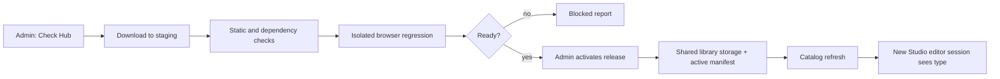

# Online H5P Studio Library Updates and Automatic Loading

Date: 2026-09-28. Scope: CREATE's self-hosted H5P Studio **official editor**. This proposal does not imply that CREATE AI can generate newly added types or that proprietary H5P.com activities are supported.

## Conclusion and current state

Administrators could inspect, prepare, and activate content types from the official open-source H5P Hub through a web interface. Newly opened editor sessions would then discover activated types automatically. Discovery, download and validation, publication, and editor activation must be separate states; a successful download does not prove usability.

Studio currently reads libraries from `routes/create/h5p-libs`, and Lumi's `FileLibraryStorage` points to the same directory. Lumi rescans the filesystem when listing libraries, but CREATE's `getStudioCatalog()` has a 30-second cache and a library root hard-coded to the source directory. The official editor selector includes only local activities whose `mode !== 'unavailable'`. Ordinary authors cannot install runnable H5P libraries. Lumi 10 still defaults to the older Hub URL, `api.h5p.org`; new releases have been published at `hub-api.h5p.org` since 2026.

In an isolated local check, adding official `H5P.Flashcards 1.7.23` and its required new dependencies to a temporary directory used by one `FileLibraryStorage` instance increased `getInstalledLibraryNames()` from 118 to 119 directories. The Studio catalog increased from 36 to 37 available activities, and Flashcards passed dependency and asset checks. This shows that **file storage and the Studio catalog can discover new activities dynamically**. Browser editing, saving, preview, export, and publication to CREATE's working library directory were not verified.

## Product workflow

Show **Studio → Library management** only to CREATE administrators:

1. **Check Hub:** Read official Hub metadata and compare it with available, installed, and disabled libraries. Show source, machine name, version, maintenance status, dependencies, and Core requirements. A scraped showcase list is not an installable package catalog.
2. **Prepare candidate:** An administrator selects a machine name. A background job downloads only from fixed official Hub hosts and reuses the unpacking, hashing, ZIP safety, and dependency checks in `scripts/h5p/maintain.py`. Store an immutable candidate, diff, and affected content types. Do not accept arbitrary URLs or author-uploaded libraries.
3. **Validate:** In an isolated environment, test editor creation and save, playback, media, export and reimport, and existing content. Block candidates that replace shared dependencies, require a newer Core, lack browser assets, or fail tests, with a specific reason.
4. **Activate:** After reviewing the result, an administrator activates the candidate. Publish it to persistent library storage and update the active manifest. New editor sessions see the type after a catalog refresh. Show its activation time, version, and validation result.
5. **Disable / roll back:** Hide a disabled type from the new-activity selector, but retain libraries and assets required by existing content. A full rollback requires matching library, content, and database snapshots; do not delete a directory still in use.

## Phase 1: Activate new content types without restarting

The initial release may **add** directories, but it must not replace an existing `machineName-major.minor` directory or change Core/Editor. A candidate can keep the currently installed version of a shared dependency only if isolated tests prove that version still works. Otherwise, the candidate enters Phase 2. This matters especially for Flashcards, whose official package contains newer patches of JoubelUI and VerticalTabs.

Move the library root to persistent shared storage outside the deployment, for example `H5P_LIBRARY_ROOT`, and initialize it from the repository's locked baseline libraries on first installation. Lumi and the Studio catalog must read **the same root**. Write candidates to a separate staging directory. After validation, atomically publish missing non-runnable dependencies first, then the runnable library, and finally write the activation record or manifest version to the database. A directory's presence alone must not make it visible: the Studio catalog and Lumi selector must also check the activation record. This prevents an interrupted publication from exposing a partial installation.

Add explicit invalidation and active-manifest version checks to `getStudioCatalog()` rather than waiting for its 30-second TTL. Synchronize instances through shared storage and a database version. An instance that has not yet observed the complete directory must report it unavailable instead of publishing an incomplete library. An open editor sees the type after reentry or refresh. Lumi rereads local directories when enumerating libraries, so Phase 1 can avoid a Node restart; browsers still need to refresh old editor pages.

Phase 1 acceptance target: activate Flashcards through the web interface in an isolated CREATE environment; find it under `New blank activity`; create, save, preview, download, and reimport its `.h5p` package; and pass basic editing/preview checks for existing types. If Flashcards cannot run with the current shared dependency versions, choose a candidate with no shared replacement or move to Phase 2 rather than calling Flashcards a live-activation example.

## Phase 2: Upgrade existing content types online

Updating existing directories, especially replacing a patch of the same major/minor version or shared dependencies such as JoubelUI, Question, or Components, changes runtime assets for current content and open pages. Lumi's `LibraryManager.updateLibrary()` removes old files and can delete a library on failure, so do not call it on a production active directory.

Use immutable complete library-release snapshots (the current baseline is about 45 MB), recording SHA-256, source, dependencies, and affected content. Validate in isolation before switching the active release. Truly uninterrupted switching requires routing browser assets by release ID and pinning existing content records/rendering to a library release; otherwise requests from an open page can span the switch. Until release-aware assets and content pinning exist, trigger a controlled rolling restart or short maintenance window from the web UI, enable the version for new sessions, and first assess regression and migration needs for historical content. Core/Editor browser files remain part of application deployment, outside the online library-update button.

## API and data boundaries

- `GET /api/create/admin/h5p-libraries`: Installed, available, and disabled libraries; upstream candidates; active release; validation results.
- `POST /api/create/admin/h5p-libraries/check`: Start a read-only Hub comparison job.
- `POST /api/create/admin/h5p-libraries/candidates`: Accept only a validated machine name and start an asynchronous staging/validation job.
- `GET /api/create/admin/h5p-libraries/candidates/:id`: Poll status, diff, blocking reasons, and test evidence.
- `POST /api/create/admin/h5p-libraries/candidates/:id/activate`: Commit only when ready and the baseline version has not changed; repeated requests are idempotent.
- `POST /api/create/admin/h5p-libraries/:machineName/disable`: Prevent new creation while preserving playback of existing content.

These endpoints use existing administrator checks and limit concurrent jobs and download size. Audit records contain only machine name, version, hash, actor, time, state, and test result; they exclude course materials, question text, user keys, and Hub credentials. In Phase 2, `H5PContent` gains the library-release ID used at creation or last migration. Multiple instances need persistent shared library storage or equivalent object storage; they cannot update separate container-local directories independently.

Show "editable in the official Studio editor" separately from "generatable by CREATE AI." After validation, a new library may be activated as **manual editor only**. AI, Quiz blueprint, Canvas, grading, and export support each require their own adaptation and validation; `runnable: true` alone proves none of them.

## Implementation order and acceptance

1. Extract a shared library root, installation-state model, catalog invalidation mechanism, and read-only admin inventory while preserving the behavior of the existing 36 types.
2. Connect the existing candidate preparer and isolated validation job, with all external inputs restricted to the official Hub. Create candidates without changing active directories.
3. Implement persistent publication of new directories, activation gates, cross-instance synchronization, and disabling. Pilot end to end with Flashcards or a candidate without shared patches.
4. Add full release snapshots, pinning/migration of old content, and rolling switch before allowing online activation of updates to existing libraries.
5. Expand the target catalog and validate missing public types in batches. ALPHA, long-unmaintained, externally dependent, or newer-Core types may remain blocked; a numeric target does not replace quality acceptance.

Acceptance must cover: unauthorized authors cannot install libraries; failed downloads or unpacking leave old directories intact; partial installations are invisible; a refreshed catalog shows the new type; real editing, saving, preview, export, and import succeed; old content still plays; concurrent activation commits once; instances agree; and old content remains accessible after disabling.

References: [Open-source Hub migration](https://h5p.org/h5p-february-2026-update), [Lumi library-installation security](https://docs.lumi.education/advanced-usage/security), [Lumi project status](https://docs.lumi.education/development/status), and [CREATE's maintenance pipeline](../h5p-maintenance-pipeline.md).
