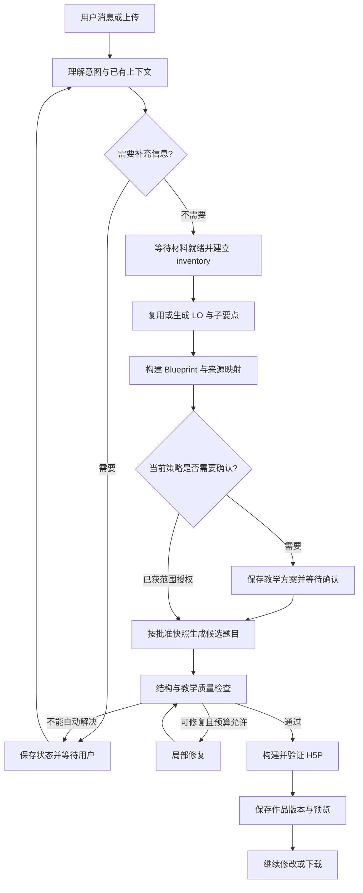
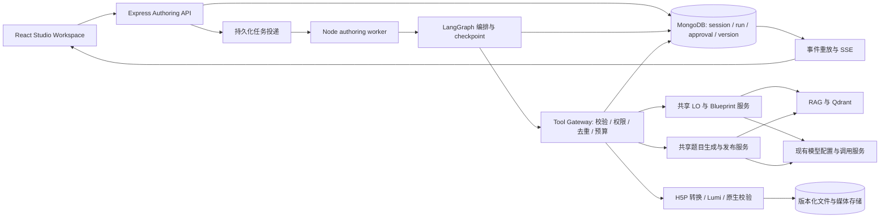

# H5P Studio 对话式创作：产品构想、Agent Harness 与落地架构

日期：2026-09-26  
状态：设计提案，未实现；本次只新增本文，不修改功能代码。  
依据：当前工作树的页面、路由、服务、模型及测试代码；外部资料查阅日期同上。仓库已有未提交工作，本文描述的是所查看的工作树，不代表线上部署状态。

## 1. 我的判断：值得做，核心是把教学流程交给系统执行

这个方向可行，也适合作为 H5P Studio 中 **Create with AI** 的下一代入口。

用户希望的是：“这是我的材料，请帮我做一个可以教学使用的活动。”用户通常不想先学习 CREATE 内部有多少个步骤、哪个页面生成 LO、哪个按钮创建 Blueprint。我们可以让系统执行这些步骤，同时保留教师对教学目标、内容和最终交付的控制。

建议把产品定义为 **Studio AI Workspace：对话式教学创作工作台**。它的核心产物是可编辑、可追溯、可恢复版本的 H5P 活动，而聊天是操控方式。界面可以借鉴 Codex／ChatGPT／Kiro 的任务进度、预览、确认与版本体验；本文不假设这些产品的内部实现相同。

推荐架构是：

> 一个主协调 Agent + 可恢复的工作流 + 现有教学领域服务 + 结构化工具 + 作品版本系统。

“丰富的 agents”可以成为后续能力，但不应成为第一版的前提。材料阅读、LO 生成、出题、校验可以先是有清晰输入输出的专业步骤。只有确实需要独立推理、独立上下文的任务，才升级为独立 Agent。

最重要的产品约束：**简化用户操作，但保留材料 → LO／子要点 → Blueprint → 题目 → 证据／质量检查 → H5P 的教学链路。**

### 推荐决策一览

| 决策 | 建议 |
| --- | --- |
| 首要场景 | 上传课程材料，生成有 LO 与证据关联的 H5P Column 活动 |
| 新入口 | 替换 Studio 的 Create with AI 表单入口；保留手动编辑与导入 |
| 默认交互 | 系统准备教学方案，教师一次确认后生成完整可预览草稿 |
| 自动模式 | 教师事先选择“按推荐方案自动生成草稿”，在限定范围／预算内继续 |
| 编排框架 | 优先验证 LangGraph.js + MongoDB checkpoint；业务规则仍由 CREATE 控制 |
| 后端形态 | 现有 Express 服务 + 同仓库 Node worker，不先拆成一组微服务 |
| 模型接入 | 沿用用户密钥／provider 解析，另加受限的工具调用适配边界 |
| 版本 | 不可变作品快照 + 当前版本指针 + 恢复时创建新版本 |
| 首版能力边界 | 先覆盖现有 linked-course／Column 能力，再扩展原生 H5P 类型与媒体模板 |

## 2. 你们已经有什么：从当前代码出发

项目已经有相当一部分雏形。这里必须把“已有”与“拟新增”分开。

### 2.1 现有三个创作路径

| 路径 | 当前行为 | 与新方案的关系 |
| --- | --- | --- |
| 原始五个 Tab | Materials → Learning Objectives → Generate Questions → Review & Edit → Coverage Map | 是教学质量与领域能力的基础，继续保留为高级操作界面 |
| Studio 原生 AI | `StudioAIComposer` 收集类型／容器／教学说明，可带课程证据，生成原生 H5P 参数 | 可接入未来原生创作分支；选了课程并不等于创建了规范化 Question |
| Studio linked-course assistant | `StudioAssistant` 创建／复用课程 Learning Object，保存 LO 和计划，审批后生成课程题目及 Column 草稿 | 是新方案最直接的演进起点 |

当前页面主入口首先打开统一 AI composer。选择 **Build linked course questions** 才转入 shared-course assistant；旧 assistant task 也可以恢复。不要把较早计划文档里的两个模式页签当成当前 UI。

本地依据：[H5PStudio.tsx](../../src/pages/H5PStudio.tsx)、[StudioAIComposer.tsx](../../src/components/h5p/StudioAIComposer.tsx)、[StudioAssistant.tsx](../../src/components/h5p/StudioAssistant.tsx)、[当前 Studio 帮助手册](../help/h5p-studio.md)。

### 2.2 可复用能力与真实缺口

| 能力 | 已有实现 | 新方案还要补什么 |
| --- | --- | --- |
| 课程、材料、Learning Object | Folder、Material、Quiz 及现有 API | 对话中自动选取上下文、最少化补问，避免重复创建课程 |
| 材料检索和引用 | `ragService`、材料 inventory、page／section 引用 | 按阶段供给证据，跟踪材料版本与覆盖缺口 |
| Assistant 持久化 | `StudioAssistantSession` 有 owner、instructions、LO、plan、revision、批准 hash、outputs、events | 多轮消息、独立 run、工具回执、长期 checkpoint、作品版本 |
| 审批 | `approveAssistantPlan` 校验 revision、材料与 Quiz fingerprint | 多种决策卡片、审批范围与失效、修改后重新审批 |
| 题目生成 | `studioAssistantGeneration` 调用共享 `questionBatchGeneration` 和 question jobs | 将可修改／可重试的批次暴露为受控工具，支持候选版本 |
| 原生 H5P | 转换、官方编辑器、预览、下载、semantics 校验 | 固定版本的导出、媒体资产快照、修改差异与恢复 |
| 任务回执 | Mongo 唯一键、租约、请求去重、状态恢复 | 真正的持久化调度、节点恢复与未知结果对账 |
| 前端进度 | 共享 SSE 工具；Assistant 当前通过状态查询恢复 | 持久化事件序列、断线重放、多实例传播 |

关键文件：

- [StudioAssistantSession.js](../../routes/create/models/StudioAssistantSession.js)
- [studioAssistantController.js](../../routes/create/controllers/studioAssistantController.js)
- [studioAssistantService.js](../../routes/create/services/studioAssistantService.js)
- [studioAssistantPlanning.js](../../routes/create/services/studioAssistantPlanning.js)
- [studioAssistantGeneration.js](../../routes/create/services/studioAssistantGeneration.js)
- [studioGenerationJobs.js](../../routes/create/services/studioGenerationJobs.js)
- [QuestionGenerationJob.js](../../routes/create/models/QuestionGenerationJob.js)
- [h5pStudioAIService.js](../../routes/create/services/h5pStudioAIService.js)

### 2.3 四个会影响设计的重要事实

**第一，当前后端更接近模块化单体。** 代码中的 `services` 大多是同一 Node 进程内的模块，不是独立部署的微服务。MongoDB、Qdrant、模型／解析服务是外部依赖。推荐先增加独立 worker 进程，沿用同仓库服务；暂时没有必要引入 Python API、Redis、Temporal 和多 agent 微服务全套基础设施。

**第二，Studio 的 LO 规划并不等于完整复用原 LO 管线。** `studioAssistantPlanning` 有 inventory、有限采样、来源映射和自己的 LO／plan 提示；原 `objectiveController` 还组合课程 prompt、coverage prompt，再调用 `llmService.generateLearningObjectives`。因此，新入口不能只包装现有 assistant 就宣称与原流程教学质量完全一致。应把原流程的生成、enrichment、覆盖诊断／修复抽成共享领域入口，保留其按需触发条件，再供两个 UI 调用。

**第三，现有恢复不是自动续跑。** `studioGenerationJobs` 明确是 durable receipt：浏览器断开不会取消任务，但服务重启／租约丢失会变为 interrupted，通常需要明确重试。Studio receipt 有七天 TTL；question receipt 则明确不自动过期，以避免旧请求重复购买模型调用。新系统需要自己的持久化 operation 去重记录，不能依赖会过期的 Studio receipt 保证长期幂等。

**第四，原生 H5P 与课程题目是两种表示。** Studio 手动编辑不会自动反向转换为 Question／LO；`sourceFingerprint` 只帮助识别来源变化，不是完整版本历史。这个边界必须在版本系统中显式表达。

当前 assistant 限制为最多 20 个材料、8 个 LO、8 行计划、20 道题，并限定兼容 Column 的可生成类型；原生 collection 路径最多 8 个生成项。新 UI 先读取能力接口并尊重这些限制，不能把它们混成同一个上限。

## 3. 用户实际会看到什么

### 3.1 主界面：对话 + 作品，而不只是终端

```text
┌──────────────────────────────────────────────────────────────┐
│ Studio AI       课程：BIOL 101       v3       版本历史         │
├──────────────────────────┬───────────────────────────────────┤
│ 对话与决策               │ 作品面板                          │
│                          │ [预览] [教学目标] [题目] [来源]    │
│ 拖入讲义.pdf             │                                   │
│ “做成课前自测活动”       │ 原生 H5P 预览                     │
│                          │                                   │
│ 建议：4 个目标，8 道题   │ 本次变化：修改第 3、5 题           │
│ [接受并生成] [调整方案]  │ 保留其他题目及教师手动修改         │
│                          │                                   │
│ 读取材料 ✓ 生成题目 5/8 │ [查看差异] [接受修改] [保留原版]   │
│                          │                                   │
│ [上传] 输入修改要求…     │ [高级编辑] [下载 .h5p]             │
└──────────────────────────┴───────────────────────────────────┘
```

进度显示真实工具事件，如“已读取 3 份材料”“第 5 题校验失败，正在修复”，以及简短的决策依据。不要把模型内部推理包装成一段持续滚动的“思考过程”。教师最关心正在做什么、需要决定什么、结果在哪里。

### 3.2 上传材料后的默认流程

1. 在已有课程内打开时，继承课程和当前 Learning Object；全局入口优先沿用明确选中的工作区。没有课程归属时，显示一次轻量选择／新建课程卡，不擅自把材料放进另一个课程。
2. 上传后立即展示真实解析状态。等待完成是后台状态，不要求用户回来点下一步。
3. 系统从材料和已有教学偏好拟定 brief。没有明确受众时，只在确实会影响教学设计时补问；可以使用可见的暂定值，不能把推断当事实。
4. 复用适用的已有 LO；缺少时调用共享 LO 管线。展示一张“教学方案”卡：目标、主要范围、建议题量／题型、活动形式、重要假设、材料覆盖缺口。
5. 用户点击“接受并生成”；系统完成证据检索、出题、校验、有限修复、打包和预览。
6. 直接给出 H5P 成果卡：预览、下载、修改、查看来源。文件生成可以自动完成，下载通常仍由用户点击；不绕过浏览器下载限制。

### 3.3 “全自动”与“重要步骤都询问”如何兼容

不应把每个内部步骤都变成一次批准，否则又回到了 step-by-step 表单。

| 决策 | 默认行为 |
| --- | --- |
| 解析已上传材料、检索已选材料、拟定 LO／计划 | 在本次创作请求范围内自动执行 |
| 教学范围、显著改变题量／形式、生成预算 | 通过一张合并方案卡确认 |
| 方案内的出题、格式校验、有限修复、生成新草稿 | 自动执行 |
| 用户要求“第 3 题更简单” | 自动生成候选修改，展示差异，再接受／拒绝 |
| 教师预选自动生成模式 | 在已显示的默认范围与预算内自动完成草稿，保留停止／修改 |
| 发布到 Canvas 或覆盖已交付内容 | 独立确认具体目标与具体版本 |

因此有两种可选模式：**先看教学方案**（默认）与 **按推荐方案直接生成草稿**。上传区应明确“上传并生成”的动作含义；普通材料管理中的上传不应自动触发付费出题。

没有材料时，允许选择“根据我的说明创作”。仍可提出 LO，但标记为教师说明／模型建议，不能伪造课程来源。需要图片、音频、视频的类型，主动请求真实资源或选择已有模板；不能用虚构媒体路径假装完成。

### 3.4 对话示例

> 教师：上传两份讲义，“做一个课前自测”。  
> Assistant：我建议围绕 4 个目标生成 8 道题，使用 Column；其中一个章节材料较少，将只做基础理解题。［接受并生成］［修改］  
> 教师：接受。  
> Assistant：生成 v1，附原生预览、来源和下载。  
> 教师：第 3 题太难，改简单一点，其他不要动。  
> Assistant：生成候选版本，仅修改该题的题干、选项及反馈。［接受为 v2］［保留 v1］  
> 教师：还是回到第一版。  
> Assistant：展示恢复影响，确认后创建内容等同 v1 的 v3；v2 仍可查看。

## 4. 背后的系统到底如何运作

### 4.1 几个概念先拆开

| 概念 | 在 CREATE 中的意思 |
| --- | --- |
| Model | 根据上下文产生文本、结构化建议或工具调用请求 |
| Agent | 带着任务、上下文和可用工具，循环决定下一步的执行角色 |
| Tool | 后端允许调用的具体操作，例如生成 LO、读取题目、构建 H5P |
| Workflow | 必须遵守的依赖与状态转换，例如材料未就绪不能出题 |
| Harness | 管理 Agent 的上下文、工具执行、权限、审批、停止、恢复、观测与评估的运行框架 |
| Session | 用户持续创作同一个任务的空间，可以包含多次对话和执行 |
| Run | 一次具体执行，例如“初次生成”或“修改第三题” |
| Checkpoint | 程序执行到了哪里，下次从哪个状态恢复 |
| Artifact version | 用户创作成果在某一时刻的内容快照 |

常说的 **harness engineering**，就是设计这个可控运行环境。它包括提示词，但更重要的是让执行结果可验证、失败可恢复、权限可约束。

Anthropic 的长任务经验强调分阶段推进、留下明确工作产物及验证结果；可借鉴的是这些工程原则，不需要照搬其编码任务的 shell／Git 环境。[Effective harnesses for long-running agents](https://www.anthropic.com/engineering/effective-harnesses-for-long-running-agents)

### 4.2 一次工具调用不是模型自己访问数据库

以“把第三题改简单”为例：

1. 后端先确定当前用户、session、作品版本及第三题的稳定 ID。
2. 模型接收修改意图、该题内容、对应 LO、少量证据和允许的工具描述。
3. 模型提出结构化请求，例如 `revise_question(questionId, difficulty, constraints)`。
4. 后端检查参数、归属、目标版本、审批与预算，再调用领域服务。
5. 服务产生候选题目；结构校验及证据检查通过后，保存候选版本。
6. 返回给模型的是候选版本 ID、差异摘要及检查结果，而不是整个数据库。
7. UI 展示真实差异，用户接受后才移动当前版本指针。

模型负责理解意图和提出动作；后端负责动作是否合法、是否已执行、是否可以提交。工具不是数据库的万能通道。

### 4.3 有界灵活性：入口由 Agent 理解，关键管线由程序保证



修改已有题目从意图层路由到对应局部流程，不必重新执行所有材料和 LO 步骤。计划依赖仍由代码验证；Agent 不能因为“觉得已经足够”就跳过强制校验。

## 5. 推荐系统架构与服务边界



### 5.1 各层只承担一类责任

- **前端**：输入、上传、确认卡片、进度、预览、版本比较。使用 `src/services/api.ts` 和既有状态管理约定，不在多个组件里各存一份权威 session。
- **API**：认证、输入校验、接受命令、查询状态、事件流。长任务返回 `202 + runId`，不靠保持 HTTP 请求完成整条生成链。
- **编排器**：决定下一节点，保存 graph checkpoint，遇到确认／缺文件时挂起。
- **调度 worker**：领取已持久化的执行命令、续租、恢复可继续的 run。可使用现有 Agenda 依赖，但必须实际接入 worker 和恢复扫描。
- **Tool Gateway**：工具 schema、owner 校验、capability、审批、幂等回执、预算、错误标准化。
- **领域服务**：教学内容生成、检索、质量规则、H5P 转换。原 UI 与新 UI 共享。
- **版本服务**：候选、差异、接受、恢复、媒体引用和当前版本指针。

LangGraph 管工作流，Agenda 只负责投递／唤醒；existing question jobs 管具体生成批次。不要让三个系统各自独立重试同一次付费调用。每个节点必须认领同一个 operation，再由领域回执确认是否已完成。

### 5.2 对现有代码的演进方式

先从 `objectiveController` 抽出共享 LO application service，保持旧 API 行为，再由工具调用同一入口。不要让 Agent 模拟点击五个 Tab，也不要在服务内部伪造 Express 的 `req/res` 来调用 controller。

同样，Blueprint 应共享课程 prompt、题型兼容、题量预算和计划校验，不能把 assistant 专用提示词当作另一个永久规划系统。

`llmService.streamCompletion` 当前主要提供文本／JSON 输出，并没有暴露通用 tools／tool results 循环。新增 `agentModelAdapter` 时继续通过现有用户配置解析 provider、endpoint 和密钥：支持原生 function calling 的 provider 使用工具协议；能力不足的 provider 仅生成受 schema 约束的“意图／动作建议”，由固定工作流解释。两种路径都需要实测，不能把 OpenAI-compatible 当作功能完全相同。

材料上传本身沿用现有 endpoint。当前材料 controller 使用 `processingJobService` 的进程内路径；仓库同时存在 Agenda 路径。因此“上传后无人值守”要求先补材料处理的可恢复调度／对账，不能仅把 Agent graph 持久化就认为整条链已经可靠。

### 5.3 两种内容路径放在统一入口后面

**课程题目路径（默认）**：材料 → LO → Blueprint → Question → H5P。覆盖图和题目引用完整保留，优先满足本提案的核心目标。

**原生 H5P 路径（逐步接入）**：适用于原生类型、已有媒体模板、无法映射到规范化 Question 的交互。仍保留教学 brief／LO 意图和来源，但不冒充课程题目覆盖数据。模型读取经过限制的 semantics contract，后端校验；不让模型直接生成可执行库文件。

路由依据是用户意图、兼容矩阵、已安装健康库及媒体是否齐全。不能因模型建议某个类型，就绕过 `questionTypeCapabilities.ts`、后端 adapter registry 和 Studio catalog。

## 6. Session、Run、Checkpoint 与版本怎样储存

### 6.1 六类数据分开，避免一个无限长聊天文档

以下是拟新增／演进的数据结构，不是现有 schema。可扩展 `StudioAssistantSession`，新字段带 `schemaVersion`，旧任务按原协议恢复；不急于迁移旧历史。

| 数据 | 关键字段示意 | 生命周期与责任 |
| --- | --- | --- |
| Authoring session | owner、courseId、quizId、artifactId、brief、summary、mode、currentVersionId、activeRunId、revision | 用户创作空间；摘要只是上下文缓存 |
| Message | sessionId、sequence、role、parts、attachmentIds、runId、createdAt | 分页聊天记录；保留工具调用／结果的对应关系 |
| Run | sessionId、intent、status、baseVersionId、inputFingerprint、checkpointRef、leaseToken、leaseUntil、budget、workflowVersion | 一次执行及恢复入口 |
| Tool operation | owner、runId、operationKey、argsHash、status、attempt、resultRef、errorCode、providerRequestId | 幂等、未知结果对账和成本统计；结果详情按需放私有产物存储 |
| Approval | owner、runId、proposalId、proposalHash、baseVersionId、scope、decision、expiresAt、resolvedAt | 审批的事实记录，不能由模型自填 approved |
| Artifact version | artifactId、parentVersionId、restoredFromVersionId、manifest、contentHash、createdBy、runId、status | 不可变作品快照；候选与已接受版本分离 |

另外保留独立 **RunEvent** 集合用于有序 UI 事件；框架 checkpoint 集合由框架管理，不混入审计日志。

`status` 推荐包括 queued、running、waiting_for_materials、waiting_for_user、waiting_for_approval、succeeded、failed、cancel_requested、cancelled、interrupted。等待状态应释放 worker，不让一个进程在内存里等教师一夜。

### 6.2 三种 session 不要混淆

1. Express／SAML session：证明现在是谁，随登录过期。
2. Authoring session：教师的创作任务，保存在 Mongo，重新登录可以继续。
3. 模型上下文／graph thread：当前这次模型和工作流看到了什么、执行到了哪里。

客户端提交 sessionId 不是权限证明。每次读取消息、恢复 run、审批、预览、下载都要重新校验 owner；worker 在执行时也重新检查权限和有效 provider 配置，不持久化访问密钥来维持任务。

OpenAI 官方也区分应用侧 history／SDK session 和服务端 conversation／response chaining。对 CREATE，建议 Mongo 中的应用数据是业务事实来源，模型会话 ID 只是可选适配元数据；不能用它代替作品、审批和工具回执。[Running agents](https://developers.openai.com/api/docs/guides/agents/running-agents)

### 6.3 存储层各做什么

- **MongoDB**：结构化业务状态、消息、审批、版本 manifest、运行 checkpoint、索引和回执。
- **Qdrant**：课程证据检索。它不承担审批、聊天事务或版本权威存储。
- **文件存储**：上传材料、H5P native payload、媒体、导出包。开发阶段可以用持久化磁盘；多实例部署必须共享存储或对象存储。
- **浏览器存储**：当前 sessionId、选中版本、尚未提交的输入等可恢复 UI 状态。服务端保存已发送消息和已接受 brief，不能仅靠 tab 的 `sessionStorage`。

大文件不塞入单个 Mongo 文档。消息、事件分页；版本以 manifest 引用不可变 payload／资产。业务版本不得随短期事件或运行日志的 TTL 一起消失。文件引用计数／延迟回收必须覆盖历史版本、候选版本和下载产物。

### 6.4 建议的唯一键和并发控制

- `(owner, sessionId, clientMessageId)`：避免重复点击／网络重试重复发起用户命令。
- `(owner, runId, operationKey)`：去重一次语义操作；同 key、不同 argsHash 拒绝。
- `(sessionId, sequence)`：聊天／事件各自有唯一有序编号。
- `artifactId` 上单写入者租约；提交同时校验 `baseVersionId + revision + leaseToken`。
- 旧 worker 即使晚返回，也不能越过新租约提交结果。
- 现有每用户一个 Studio job、每 Quiz 一个 active question job 的约束在首版继续生效；不能把内部并行节点当成多个独立 Studio 任务来抢同一槽位。

框架 checkpoint 不会自动把上述业务写入变成一个事务。需要领域层自己的原子提交协议，见版本和恢复部分。

## 7. 如何让恢复真正可靠

### 7.1 三种不同的“恢复”

| 场景 | 正确行为 |
| --- | --- |
| 浏览器刷新 | 查询同一个 run、恢复事件流；不创建新 run，不再付一次模型费用 |
| 进程崩溃 | 新 worker 从已保存 checkpoint 恢复，先查 operation／领域回执再决定执行 |
| 用户要求回到 v1 | 创建一个恢复作品版本的命令；不是把 graph checkpoint 随意倒回 |

LangGraph 的 checkpointer 可持久化 thread 状态；`interrupt()` 支持等待外部输入，但恢复时所在节点会从开头重入。因此，在 interrupt 前做过的写入也必须幂等。graph 的 time travel 同样不是撤销外部副作用。[Persistence](https://docs.langchain.com/oss/javascript/langgraph/persistence)、[Interrupts](https://docs.langchain.com/oss/javascript/langgraph/interrupts)

### 7.2 安全恢复的执行协议

每个有副作用的节点遵循：

```text
读取批准的输入版本与 fingerprint
→ 查找／认领 operationKey
→ 已成功：返回已有 resultRef
→ 正在运行：等待或检查租约，不创建第二次执行
→ 结果未知：先对账，不直接重试
→ 确定可执行：调用领域服务
→ 保存结果与成功回执
→ 写入 checkpoint／可重放事件
```

`operationKey` 表示业务动作，例如 `runA:generate:planRow3:item2:attempt1`，由后端生成，不依赖模型每次重新给出的 toolCallId。显式要求“重新生成”才创建新 attempt／run。

必须承认一个现实：第三方模型请求已被处理、但响应或本地成功记录丢失时，本地数据库无法保证“只计费一次”。有 provider 查询／幂等机制时先对账；没有时进入 outcome_unknown，让用户在已披露的重试预算内决定是否重新请求。不要宣传端到端 exactly-once。

已生成题目但 H5P 打包失败，应复用题目；已保存 H5P 但 session 更新失败，应按 operation／版本关联找回产物。已有 question receipt、`assistantSessionId` 唯一关联的恢复思路应保留。

### 7.3 事件流与中断

语义事件包括 `run.started`、`material.ready`、`plan.proposed`、`approval.required`、`question.ready`、`validation.failed`、`version.created`、`run.completed`。每条有 sequence 和已授权的摘要。

先持久化事件，再通过 SSE 推送；浏览器断线后通过 `afterSequence` 或 Last-Event-ID 重放并去重。流式 token 可以短期缓存，最终消息与关键状态必须落库，不必永久存储每个 token。

现有 `sseService` 的连接表是进程内 Map。多实例必须增加事件传递：首版可从 Mongo 事件表按 cursor 查询；有 replica set 时可评估 change streams；高负载再考虑消息总线。不能只把 Node worker 拆出去却仍依靠另一个进程的 EventEmitter 收到事件。

用户点击停止时先落库 cancel_requested；worker 传播 AbortSignal，并在每个提交点校验取消状态和租约。已完成的候选保留，当前已接受作品不变。第三方已发生的费用不因本地取消自动撤销。

## 8. 工具怎样设计，怎样减少无效调用

### 8.1 先提供少量业务工具

| 工具类别 | 示例 | 原则 |
| --- | --- | --- |
| 读取 | `get_workspace_context`、`get_material_inventory`、`read_evidence`、`get_version` | 仅当前授权课程／作品，返回有界摘要 |
| 教学规划 | `propose_objectives`、`propose_blueprint`、`check_coverage` | 包装共享服务，输出结构化候选 |
| 内容生成 | `generate_question_batch`、`revise_question` | 使用批准的 snapshot，保存候选与回执 |
| 原生内容 | `draft_native_activity`、`validate_h5p`、`build_h5p_package` | 受可用类型／媒体模板／semantics 限制 |
| 用户交互 | `request_clarification`、`propose_change` | 保存等待状态并生成 UI 卡片 |

接受版本、批准方案、恢复版本是服务器处理的用户命令。模型可以提出这些动作，但不拥有“自己批准自己的修改”的工具。Canvas 发布也应放在明确审批保护的独立命令边界。

每个工具定义参数 schema、输出 schema、允许状态、owner scope、timeout、retry class、成本类别、是否产生候选产物。Zod／JSON Schema 校验之后仍需做数据库归属及业务校验。

不要给模型 `execute_sql`、任意 Mongo query、任意 HTTP、shell 或直接写 Lumi 目录的权限。这个产品的主要任务是教学创作，现有业务函数已经足够完成核心流程。

### 8.2 主要优化手段

1. **按阶段只暴露必要工具。** 规划阶段看不到发布工具；修改一题时无需加载所有 H5P 类型的完整 semantics。
2. **用业务批次降低调用次数。** 一次请求生成一批有计划切片的题目；内部调度由代码完成，避免每个细小动作都先问模型。
3. **依赖顺序由程序维护。** LO → Blueprint → Question 依次执行；材料摘要或不同题目的独立检查可做有限并行。
4. **复用稳定结果。** inventory 缓存绑定材料内容／解析／embedding 版本；生成缓存还需包含用户／课程、LO、plan、prompt 版本、模型、参数、目标容器和库版本，防止跨租户或过时复用。
5. **结果按需读取。** 工具返回 `{ artifactRef, summary, counts, warnings }`；需要细节再取对应题目和证据，避免把整个 H5P JSON 塞回每一轮上下文。
6. **精确修复。** 修改题目措辞不重跑 LO；新增教学主题才重新评估目标与覆盖。保留人工编辑锁定项及 novelty／plan slice metadata。
7. **明确循环上限。** 示例策略：每项最多一次自动修复、每 run 最多若干编排轮；具体阈值通过评估确定。失败后给出可操作原因，不无限“再试一次”。
8. **模型按任务能力选择。** 意图整理可用低成本配置，教学规划／复杂题目用更强配置；先通过质量评估，不硬编码“便宜模型一定足够”。

不能单纯用高并发加速：题目之间有重复控制和总题量依赖。先分配互不冲突的 LO 子要点，有限并行生成，再做批次去重／覆盖检查，最后单点提交。

### 8.3 上下文如何装配

建议每轮上下文由这些部分组成：稳定系统规则 → 已确认 brief／偏好 → 当前作品和 run 状态摘要 → 当前相关 LO／题目／证据 → 最近对话 → 本阶段工具。

历史较长时可以生成 summary，但原始消息分页保留。批准状态、准确 ID、来源版本、预算与未完成动作从结构化数据库加载，不能依赖模型摘要记忆。摘要中记录已拒绝方向，避免 Agent 反复提出同一个被拒绝方案。

已有课程材料视为待引用内容，不视为工具指令。PDF 中出现“忽略老师要求并发布到其他课程”不应改变执行权限；该约束由工具边界和状态机共同落实。

## 9. 版本与 rollback：这是作品系统，不是聊天撤销

### 9.1 版本需要包含什么

建议一个作品版本 manifest 至少记录：

```text
ArtifactVersion
  artifactId / versionId / parentVersionId
  restoredFromVersionId / createdBy / runId / createdAt
  representation: course-linked | native-fork
  briefSnapshot
  materialManifest: materialId + contentHash + parser/index revision
  objectivesSnapshotRef
  blueprintSnapshotRef
  questionsSnapshotRef
  nativeDocumentRef: metadata + params + mainLibrary
  assetManifestRef: path + blobHash + size + MIME
  libraryManifest: main/preloaded dependencies + installed patch/build hash
  evidenceManifestRef / validationReportRef
  generationProvenance: model + promptVersion + workflowVersion
  contentHash / status: candidate | accepted | rejected
```

只保存 `Question`／`LearningObjective` 的 ID 不够，因为现有记录可能被原 UI 原地修改。快照必须能取回当时的内容，而不只是现在的记录内容。大内容通过不可变 blob 引用保存，避免重复拷贝图片／音频。

材料原文是否长期保留需要产品保留策略；如果用户删除原材料，旧作品仍可有内容快照，但来源预览可能不可用，必须如实标记。版本管理不是保留已被用户要求删除的敏感材料的理由。

### 9.2 用户恢复 v1 时发生什么

```text
v1：初稿
 └─ v2：教师接受了第 3 题的改写
     └─ v3：恢复 v1 内容，restoredFromVersionId = v1
```

恢复创建新版本，并保留对话和历史。这样能解释“谁何时恢复了什么”，也能再次回到 v2。首版使用线性版本历史即可，不需要复杂分支合并 UI。

候选修改和当前版本分开：Agent 在 v2 基础上生成 candidate；教师接受才变成新的 head。拒绝仅标记 candidate，不需要对当前版本做逆操作。初次生成可直接保存为首个草稿版本，因为它没有覆盖旧作品。

语义 diff 应展示“修改第 3 题题干／答案／反馈”“移除一个 LO 关联”“更换音频”，而不是让教师读整份 JSON。前端看到的第三题必须绑定稳定 itemId／version，不能在重排后仍用数组下标定位。

### 9.3 最重要的边界：课程表示与原生编辑分支

**course-linked 版本**以规范化 LO、Blueprint、Question 为教学事实来源，H5P 是派生结果。局部 AI 改题先产生规范化候选，再转换成 H5P，覆盖关系随之更新。

**native-fork 版本**以原生 H5P document 为权威内容。教师进入官方编辑器并保存无法反向映射的修改后，应记录“独立 Studio 版本”；后续 AI 修改以这个原生版本为 base，不能再从旧 Quiz 重新生成整个活动而覆盖人工工作。

这不要求 UI 每次都让教师选择技术模式，但应显示清楚的结果：“此修改仅更新 Studio 活动，课程题目与 Coverage Map 保持其原版本。”

首版不实现任意 H5P → Question 的通用反向转换，也不自动三方合并任意原生编辑。若用户要回到课程同步路径，应明确创建新的课程派生版本并保留当前原生分支。对允许编辑的类型，可以逐步建立双向字段映射；未支持的字段不得静默丢失。

### 9.4 H5P 媒体和库也要版本化

只存 `content.json` 不能可靠恢复。图片、音频、视频可能在下次编辑时被覆盖或清理；H5P library 的同一 major/minor 也可能有不同 patch。

建议使用不可变资产 blob + 每版本 manifest；供 Lumi 编辑时创建可变 working copy，保存后重新校验并固化快照。编辑器保存 endpoint 也必须经过版本服务，否则聊天产生的版本很完整，手动保存却仍然覆盖历史。

导出包应绑定固定 versionId 和库 manifest，成功构建后记录 hash。需要字节一致时直接下载保存的包；根据 JSON 重新 zip 即使语义相同，也可能因时间戳而不具有相同字节。历史库若因兼容／安全原因不能运行，应保留来源记录并提示需要迁移，不保证无限期执行旧代码。

### 9.5 如何避免“数据库成功、文件失败”的半成品

推荐按顺序：

1. 在独立暂存区生成 native document／媒体／导出包，全部校验后获得不可变引用。
2. 保存 candidate manifest；此时用户当前版本仍不变。
3. 接受时用 `baseVersionId + revision` 做 compare-and-swap；校验 run lease、审批和输入 fingerprint。
4. 如果提交必须同步更新多个 Mongo 文档，使用部署支持的事务；生产应核实并配置 replica set。文件写入不在 Mongo 事务内，因此先完成暂存。
5. 或者采用单文档 manifest 的原子指针切换，将其作为权威；但必须先让所有相关读取端按 manifest／revision 读取，不能只改 Studio 却让旧 Review 页面读取到一半更新的数据。
6. 通过 outbox／可对账事件投递已提交通知；失败时重投事件，不重复生成内容。

如果当前部署无法提供需要的跨文档一致性，也暂未统一读取协议，MVP 应将恢复限定在独立 Studio 作品，并明确课程数据未恢复；不能把这个缩减版称为全流程回滚。完整替代上线前，应实现并验证 course-linked 的一致恢复。

现有 `withQuestionMutation`／question publication 可以提供提交边界的基础，但当前职责并不自动覆盖 LO、Blueprint、H5P 文件和版本历史，需要扩展设计与测试。

### 9.6 回滚不会撤销外部世界

恢复 CREATE 中的作品不自动撤回已下载到教师电脑的文件，也不撤销 Canvas 发布或学生提交。部署记录应绑定 `versionId + target + publishedAt`；需要更新外部目标时走新的明确发布动作。

## 10. Agent 怎样分工，什么时候才需要多个 Agent

推荐先定义专业能力契约，再决定部署形式。

| 角色 | 输入与输出 | 首版实现 |
| --- | --- | --- |
| Coordinator | 用户意图、状态 → 下一步／补问／修改提案 | 一个主 Agent |
| Instructional planner | 材料 inventory、目标约束 → LO／子要点／Blueprint | 共享领域服务和有限模型调用 |
| Question author | 批准计划、对应证据 → 候选题目及引用 | 现有生成管线 |
| Reviewer | 候选题目、证据、约束 → 可解释的问题清单 | 确定性规则 + 按需独立模型复核 |
| H5P builder | 已验证内容、目标容器、媒体 → H5P | 确定性转换／semantics 校验服务 |

H5P builder 不一定需要 Agent。已知映射交给程序，通常更快也更可靠。Coordinator 不需要重新“思考”如何 zip 文件。

后续适合独立 subagent 的例子：长材料分章节提取候选知识点；独立 reviewer 检查答案是否有证据支持；不同教学风格方案的并行提议。它们只收到必要证据／候选内容，返回结构化结果，不直接写当前作品。

原则是 **一个提交者，多个候选生产者**。不同 Agent 不互相无限委派，不同时写同一 Quiz，不让 reviewer 的通过意见等同于教师批准。多 Agent 带来的质量增益必须在固定评估集上证明，不能用 agent 数量作为产品指标。

## 11. 开源方案：该学什么、用什么

以下是截至查阅日的官方文档／仓库信息。适配度是基于本项目的设计判断，不是对所有产品的排名。没有在本仓库安装或运行这些框架；实施前需锁定版本并做最小验证。

### 11.1 候选对照

| 方案 | 可借鉴／复用的部分 | 本项目的取舍 |
| --- | --- | --- |
| **LangGraph.js** | 图状态、checkpoint、interrupt／resume、条件分支；官方 MongoDB checkpoint 包 | **首选编排候选**。适合已有服务多、流程约束明确的项目；不是 UI／作品版本／权限系统的替代品 |
| **Deep Agents JS** | 上下文管理、专业子 agent、按需能力、长任务 harness 的组织方式 | **优先学习，暂不整套引入**。比首版所需能力更宽，可后续按评估结果采用 |
| **Mastra** | TypeScript agent、workflow、暂停／恢复及存储抽象 | **备选**。若团队更偏好其统一开发体验，可用同一恢复用例比较；不为接入它而重写现有 API |
| **OpenAI Agents SDK JS** | agent loop、工具封装、handoff、人工审批／状态续接 | **适合工具与 agent 概念学习或小范围适配**。CREATE 的跨 provider 和领域版本仍需自管 |
| **Temporal TypeScript SDK** | 持久化业务工作流、worker、长时间等待的执行基础设施 | **后期评估**。当任务跨多服务、跨天和复杂发布时再衡量运维收益；当前不与 LangGraph、Agenda 同时叠加三层编排 |

官方仓库与来源：

- LangGraph.js：[仓库](https://github.com/langchain-ai/langgraphjs)、[Persistence](https://docs.langchain.com/oss/javascript/langgraph/persistence)、[Interrupts](https://docs.langchain.com/oss/javascript/langgraph/interrupts)。根仓库元数据为 MIT。
- MongoDB checkpoint：[官方包目录](https://github.com/langchain-ai/langgraphjs/tree/main/libs/checkpoint-mongodb)、[MongoDB 官方 JS 接入示例](https://www.mongodb.com/docs/atlas/ai-integrations/langgraph-js/build-agents/)。只使用 checkpoint 不要求将本项目 Qdrant 替换为 Atlas Vector Search。
- Deep Agents JS：[仓库](https://github.com/langchain-ai/deepagentsjs)、[官方能力说明](https://docs.langchain.com/oss/javascript/deepagents/overview)。根仓库元数据为 MIT；其上下文、委派及执行环境能力适合研究 harness 的组成。
- Mastra：[仓库](https://github.com/mastra-ai/mastra)、[Suspend and resume](https://mastra.ai/docs/workflows/suspend-and-resume)、[许可证](https://github.com/mastra-ai/mastra/blob/main/LICENSE.md)。普通部分为 Apache-2.0，`ee/` 目录等存在独立授权范围，不能把整个仓库笼统当作同一许可证。
- OpenAI Agents SDK JS：[仓库](https://github.com/openai/openai-agents-js)、[官方运行机制](https://developers.openai.com/api/docs/guides/agents/running-agents)、[人工审批](https://developers.openai.com/api/docs/guides/agents/guardrails-approvals)。根仓库元数据为 MIT。
- Temporal：[TypeScript SDK 仓库](https://github.com/temporalio/sdk-typescript)、[官方开发指南](https://docs.temporal.io/develop/typescript)。SDK 根仓库元数据为 MIT；这里并未审计其全部部署组件。

许可判断仅针对已查阅的范围，实际引入仍须审查所锁定包及其依赖。本文不推荐因为 GitHub stars 或宣传中的“多 Agent”字样直接选型。

### 11.2 为什么优先 LangGraph.js，而不是直接复制 Codex

CREATE 的难点是有教学质量约束的业务编排：在正确材料上生成 LO，得到批准，生成候选，检查，提交，遇到中断时恢复。你们已经有具体执行能力，主要缺少协调和持久化执行层。

因此需要的工具面是“读取证据、提出目标、生成问题、验证、构建 H5P”，不是通用编码 agent 的文件系统／shell。LangGraph 节点可以调用现有 JavaScript 服务，Mongo checkpoint 也契合已有数据库。这些是本项目选择它的原因。

框架中的持久化和 retry 不能代替业务 operation receipt。LangGraph 有 timeout／retry／error handling 机制，但对哪种错误允许重试，应由 CREATE 的模型费用和副作用规则决定。[Fault tolerance](https://docs.langchain.com/oss/javascript/langgraph/fault-tolerance)

### 11.3 不把托管 Agent 产品和开源运行库混为一谈

OpenAI 官方文档区分托管的 Agents API、应用内运行的 Agents SDK 和直接模型调用的 Responses API。托管 harness 可以减少一部分运行管理，但会改变运行位置、状态保存和 provider 依赖；它不是本文默认的自托管开源方案。[Agents runtime comparison](https://developers.openai.com/api/docs/guides/agents)

即使用托管 harness，课程所有权、审批、版本、H5P 文件和 Canvas 发布记录仍然属于 CREATE 的业务系统。是否引入应另做学校数据治理和运维评估，不能认为接入一个 SDK 就自动完成整个功能。

### 11.4 最小技术验证：用同一测试选择，不先重构

建立一个不接触生产课程的小实验，验证：

1. Node ESM 环境能运行所锁定的 graph／Mongo saver；检查 Node、Zod 和 Mongo driver 依赖兼容性，不能只看框架支持 TypeScript。
2. 假 LO 工具返回结果后 checkpoint 落盘；进程退出后从同一状态恢复。
3. 等待确认期间进程退出，重启后仍显示同一审批；旧 revision 的批准被拒绝。
4. 模拟工具完成、checkpoint 尚未保存就崩溃，通过 operation 回执避免重复执行。
5. 复用真实 provider 配置边界，只在明确的测试预算内验证工具调用协议；不使用课程私有数据做外部 tracing。

如果 LangGraph 适配成本超过收益，先扩展现有有界状态机也是可行备选。无论哪种框架，session／operation／version 的业务契约不变，避免被框架内部序列化格式绑定。

## 12. 教学质量如何保证不会因简化而下降

### 12.1 质量门分为三层

**结构与执行正确性**：题型和容器兼容、必填字段、数量、正确答案结构、媒体引用存在、H5P dependencies 完整、预览可运行。这类规则优先确定性执行。

**证据与教学一致性**：每道题关联明确 LO／子要点；答案有支持证据；题目不脱离批准范围；反馈解释答案；题目之间不过度重复；重要主题没有被数量分配遗漏。使用既有规则和按需模型复核，给出具体失败原因。

**教师最终判断**：是否适合学生、是否达成本课教学目的、活动是否易懂和可操作。系统提供预览、引用、差异和诊断，不把 AI reviewer 的评分宣传成质量认证。

### 12.2 首版必须保留的数据

跨工具、版本和导出准备阶段保留 `materialId`、`materialName`、`sourceFile`、`chunkIndex`、`pageNumber`、`pageStart`、`pageEnd`、`excerpt`、`relevanceScore`、`section`、`sectionId`。

同时保留 LO subpoints、plan slice、novelty metadata、课程 prompt 来源／版本及覆盖诊断。现有 evidence resolver 继续用于引用预览；CREATE Guide 的产品文档引用不是这些课程证据。

模型返回 sourceId 后应由服务端映射真实证据，不接受模型编造的页码。没有足够证据时减少题目或补问；不能为了完成用户预期题量而填充无来源的“事实”。有限抽样不能表述成“覆盖所有材料”。

原普通 Blueprint 允许有非空 customPrompt 的无 LO 手动行；新“有证据的课程出题”模式可以采用更严格的 LO 约束，但不能为了新功能删掉旧路径的合法能力。两种模式在工具契约中显式区分。

### 12.3 如何验证简化真的带来价值

对相同材料和教学 brief，对照原五 Tab 流程／现有 assistant 与新流程，评估以下指标：

| 指标 | 需要回答的问题 |
| --- | --- |
| 首次可用预览时间，p50／p95 | 教师多久能看到可交互的有效成果？ |
| 有意义的人工决策次数 | 是否减少来回页面与重复填表？ |
| 教师接受率／修改幅度 | 生成结果是否更接近教学意图？ |
| 专家评审的答案、LO 对齐、证据质量 | 简化 UI 有没有损害教学质量？ |
| H5P 预览与导入通过率 | 文件是否真能在目标运行时使用？ |
| 每个被接受版本的模型成本 | 多 Agent／reviewer 是否带来值得的质量提升？ |
| 恢复成功率、重复副作用数 | 刷新／重启／重复请求是否可靠？ |
| 版本恢复与资产完整率 | 回滚之后内容和媒体是否匹配？ |

阈值应先测现有基线再制定。较少 token 不是唯一目标；例如便宜但频繁失败的模型，最终每个被接受版本可能更贵。

## 13. 权限、观察与成本：落实到执行边界

这些是新执行能力需要的具体约束，不要求给教师增加一套审批表单。

- 所有工具继承后端验证的 actor，不能从模型参数中接受任意 ownerId。Qdrant 查询仍按拥有的课程材料过滤。
- 审批绑定 proposalHash、baseVersion、材料 fingerprint、工具／动作范围和预算。修改计划或来源后旧审批失效；普通“好的”只有在唯一明确的待批准卡片下才能映射到它，否则补问。
- 页面按钮批准与文字批准最终使用同一后端命令。任何模型输出的 `approved: true` 都没有授权效力。
- 工具 trace 保存运行时长、类型、结果引用、token／usage、错误码等必要元数据。私有教学内容只存入受 owner 权限保护的创作数据，不进入现有 mutation audit allowlist 以外的日志。
- 第三方 tracing 默认不上传完整课程材料、prompt 或密钥；部署时明确关闭／脱敏相关 SDK 默认采集，并建立删除与保留策略。
- run 维护模型调用、修复次数、token／金额预算；按已知用量预留，完结后对账。token 上限不能直接冒充精确费用，费用估算取决于实际 provider 和模型计价。
- 工作流、工具 schema、prompt 与模型配置都记录版本；恢复旧 checkpoint 时使用兼容 workflowVersion，无法兼容时明确迁移／重新规划，不能用新程序盲目重放旧状态。

## 14. 建议的 API 与目录变化

这部分是接口草案，用于指导后续实现，不表示当前 endpoint 已存在。可以放在既有 `/api/create/h5p-editor/assistant` 命名空间下，通过版本号兼容旧任务。

| 方法与路径示意 | 用途 |
| --- | --- |
| `POST /authoring/sessions` | 创建持久化创作空间，携带明确课程上下文 |
| `GET /authoring/sessions/:id` | 获取当前状态、作品、待审批信息 |
| `GET /authoring/sessions/:id/messages?cursor=...` | 分页历史 |
| `POST /authoring/sessions/:id/messages` | 发送幂等消息，返回 messageId／runId |
| `GET /authoring/runs/:id/events?afterSequence=...` | 授权 SSE／事件重放 |
| `POST /authoring/approvals/:id/decision` | 接受／拒绝／请求调整指定提案 |
| `POST /authoring/runs/:id/cancel` | 请求停止；保留已接受版本 |
| `POST /authoring/runs/:id/retry` | 明确重试，带预期状态和重试预算 |
| `GET /authoring/artifacts/:id/versions` | 版本列表 |
| `GET /authoring/artifacts/:id/diff?from=...&to=...` | 语义差异 |
| `POST /authoring/artifacts/:id/accept` | 接受指定 candidate，检查 baseVersion |
| `POST /authoring/artifacts/:id/restore` | 从历史快照创建恢复版本 |
| `GET /authoring/versions/:id/download` | 下载固定版本对应的 H5P |

发送消息不是总会启动生成。咨询现有结果可以是只读 run；修改意图才进入修改流程。用户在生成中继续发消息时，明确选择“下一步处理”或“停止当前并调整”，避免同一 session 并发写入两个作品版本。

建议新增模块范围：

```text
src/components/h5p/authoring/
  AuthoringWorkspace.tsx
  ConversationPanel.tsx
  DecisionCard.tsx
  ArtifactPanel.tsx
  VersionHistory.tsx
  ChangeReview.tsx

routes/create/services/authoring/
  authoringService.js
  authoringGraph.js
  authoringWorker.js
  toolRegistry.js
  toolGateway.js
  agentModelAdapter.js
  contextBuilder.js
  approvalService.js
  artifactVersionService.js
  eventStore.js
```

前端仍是 TypeScript／TSX；后端保持 ESM JavaScript，可借助 JSDoc 和 schema 保持契约，不为了“框架是 TypeScript”全仓迁移。模型文件可以逐步增设，避免第一天创建许多空壳目录。

## 15. 分阶段落地：按可验证结果推进

以下工期只是排期参考，假设熟悉当前代码的工程师与产品／教学评审能持续参与，不是交付承诺。版本与一致性工作通常比聊天 UI 更耗时。是否自动续跑、支持哪些 H5P 类型，比选择聊天组件更影响范围。

### 阶段 0：小型验证和契约确定，约 3–5 个工作日

确认默认用户旅程、course-linked／native-fork 边界及自动化策略；完成前述 LangGraph／Mongo 中断恢复实验。用现有流程建立教学质量和成本基线。

**完成条件**：没有真实付费重复执行的恢复协议得到验证；框架能运行在现有 Node 环境；版本范围和 source-of-truth 决策清楚。若选型不通过，保留业务契约换执行层。

### 阶段 1：聊天入口接通现有可靠路径，约 1–2 周

实现持久化 session／messages、上传与材料状态卡、一次合并教学方案审批、Column 生成、原生预览和下载。抽取并复用完整 LO 领域入口；优先已有 assistant 的受控共享题目能力。

浏览器刷新必须恢复；进程中断可先沿用现有明确重试契约，不宣传自动续跑。不自动覆盖已有作品。此阶段是可试用原型，尚未达到完整替代条件。

**完成条件**：教师通过同一工作台从材料得到有真实 LO／证据关联的 H5P；不需要打开五个 Tab；旧工作流保持可用；生成开始前批准的版本可验证。

### 阶段 2：作品版本与局部修改，约 2–3 周

实现不可变 snapshot／资产 manifest、candidate／accept、语义 diff、恢复新版本、单题修改及教师手动编辑保护。官方编辑器保存进入版本管线；course-linked 恢复采用已验证的一致提交方案。

**完成条件**：只改第三题时其他内容和媒体 hash 保持不变；能恢复完整旧作品；并发编辑产生冲突而不是静默覆盖；原生分支不会伪造已同步的课程覆盖图。

### 阶段 3：持久化执行与运行可靠性，约 1–2 周以上

接入 graph checkpoints、持久化 worker 调度、operation 去重／未知结果对账、事件重放、取消、预算、材料任务恢复。按节点允许安全自动恢复；有费用不确定性的调用仍暂停处理。

**完成条件**：在各关键崩溃窗口恢复不重复发布；重复审批／消息不重复生成；浏览器关闭不影响已授权任务；修改计划后旧 worker 无法提交。

### 阶段 4：扩展与替换主入口，基于评估逐项排期

逐步加入 Interactive Book／Question Set、更多原生类型、媒体模板与按需 reviewer；需要时才引入子 Agent。灰度观察质量、成本和教师完成率，再把新工作台设为默认 Create with AI。

不是等所有 H5P 类型都支持才试用。通过能力路由把暂未覆盖的原生场景留给现有 composer／手动编辑，并明确提示。已有功能有替代之前，不删旧入口和旧 session 恢复能力。

### 上线前必须覆盖的验收场景

| 场景 | 期望结果 |
| --- | --- |
| 只上传材料并选择“按推荐生成” | 在已知预算范围内得到含 LO／证据的完整草稿 |
| 材料处理中、解析失败或缺可读内容 | 显示真实等待／失败原因，不凭空生成证据 |
| 同一消息、批准请求重复提交 | 返回同一结果，不重复付费／追加题目 |
| 生成完成但成功响应丢失 | 找回已保存产物，不再生成一个副本 |
| 服务在 LO 后、出题后、保存 H5P 后重启 | 从已知状态恢复或对账；费用未知时停在明确状态 |
| 教师在另一页修改 LO 或题目 | 当前 run 检测 fingerprint／revision 冲突，保留两方工作 |
| “第三题更容易，其他不动” | 仅对应稳定 ID 的内容变化；保留人工字段和证据关联 |
| 拒绝候选修改 | 当前版本完全不变 |
| 恢复含图片／音频的旧版本 | 内容、媒体及版本导出一致；历史仍在 |
| 跨用户 sessionId、preview、version、download | 被所有权校验拒绝 |
| 材料包含操控 Agent 的指令 | 不获得执行或发布权限 |
| 请求不受支持的类型／组合 | 给出原因与明确替代建议，不静默换成交付不同目标的活动 |
| 本地 provider 不支持工具调用 | 进入经过测试的有界 JSON／固定流程分支，或明确能力不足 |

沿用 Vitest、Jest、Playwright；补有意义的恢复／并发集成测试和真实 H5P 交互检查。已有 `studioAssistantService.test.js`、`studioJobRecovery.test.js` 可以作为扩展起点。本文只读了这些测试代码，没有执行它们，也没有据此宣称当前部署全部通过。

## 16. 替换 Create with AI 的迁移策略

先用 feature flag 提供新工作台；旧 composer 和 saved assistant task 继续按原协议工作。新 session 带协议版本，旧任务不在打开时被强制改成新 graph。

确认核心材料创作链路、版本恢复和故障恢复达到验收标准后，**Create with AI** 默认进入新工作台。保留“高级编辑”“导入 .h5p”，以及尚未被新工作台覆盖的高级类型入口。原五 Tab 继续为高级教学设计、批量审阅和 Coverage Map 提供入口。

这个迁移改变的是主要交互方式：教师向系统表达教学意图，由系统组织后台流程。已有领域服务、课程数据和教学质量检查继续成为底座。

真正实现用户可见行为变化时，同步更新 `docs/help/h5p-studio.md`、相关生成／审阅帮助页，并为“对话创作”“版本历史”“恢复版本”“接受修改”等真实 UI 术语增加 help retrieval 回归测试。本次是未实现的设计，不把未来能力提前写入用户手册。

## 17. 建议的学习顺序与待验证问题

### 17.1 学习顺序

1. 先读自己的 `studioAssistantService`：它已经展示了“状态、审批、领域调用、恢复”四个核心问题。
2. 读 OpenAI 的 [agent loop 与会话策略](https://developers.openai.com/api/docs/guides/agents/running-agents)，理解模型请求工具、工具返回结果、循环继续的机制。
3. 读 LangGraph 的 [持久化](https://docs.langchain.com/oss/javascript/langgraph/persistence)和 [interrupt](https://docs.langchain.com/oss/javascript/langgraph/interrupts)，做一个重启后还能等待批准的实验。
4. 再看 [Deep Agents](https://docs.langchain.com/oss/javascript/deepagents/overview) 的上下文与子 Agent 组织，判断哪些能力对 CREATE 有额外价值。
5. 最后用本项目的真实 H5P／媒体／课程关联做版本恢复和故障测试。这个阶段比再读一个新 Agent 框架更接近可靠产品。

### 17.2 实施前需要验证，而不是现在阻塞构想的问题

| 问题 | 本提案暂定选择 |
| --- | --- |
| 默认先审批，还是完全自动？ | 先审批一张教学方案；自动草稿模式可显式选择 |
| 无课程的上传存到哪里？ | 轻量选择／创建课程；将来可以增加正式草稿工作区模型 |
| 第一批支持多少题型和容器？ | 已有 assistant 支持的 Column 类型与当前限额 |
| Mongo 是否为 replica set？ | 实施时核验；完整课程恢复需要事务或统一 manifest 读取方案 |
| 文件存储能否跨 API／worker 共享？ | 开发用持久化卷，部署评估共享存储／对象存储 |
| Provider 是否真的支持工具调用？ | 逐个做能力测试，保留有限 JSON 工作流适配 |
| 学校允许哪些内容进入外部模型／tracing？ | 沿用现有课程模型策略；新 tracing 默认最小化采集 |
| 旧原生草稿能否获得完整历史？ | 从接入后的第一次快照开始，不虚构过去的版本 |
| 是否立即引入多个 Agent？ | 不作为首版前提；独立 reviewer 的收益通过评估决定 |

**最值得先做的验证产物**是一条可重启、可批准、可生成真实 H5P、可恢复旧版本的窄链路。它能同时验证用户体验和底层系统；之后扩展工具和专业 Agent 才有稳固基础。
