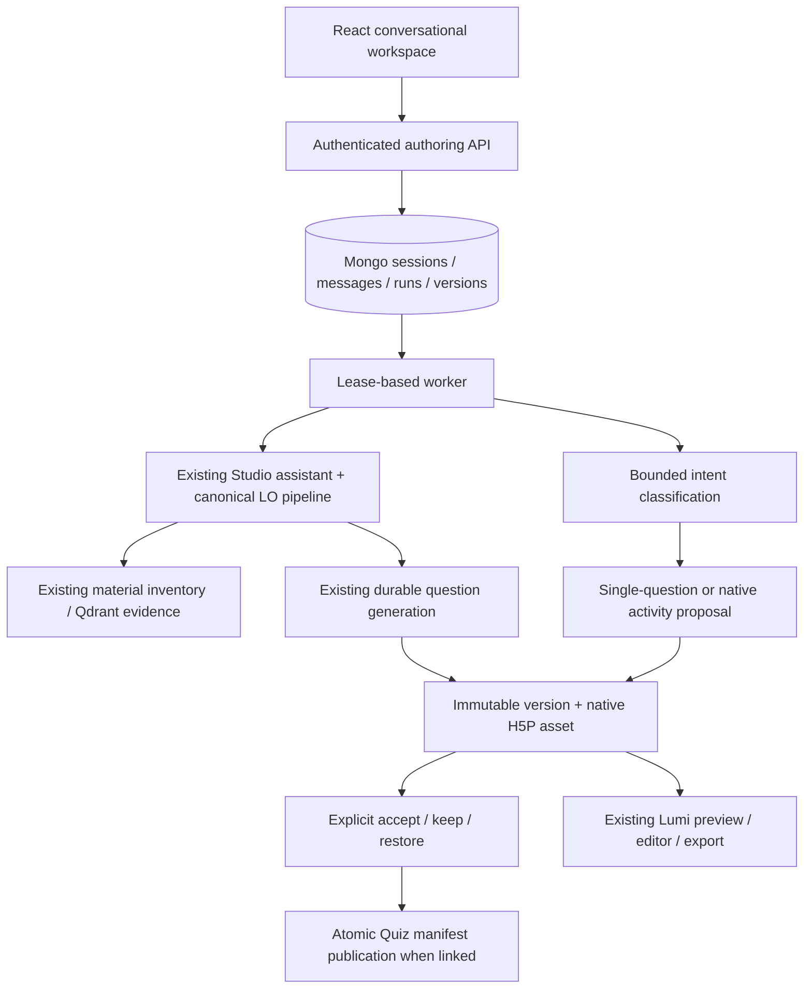

# H5P Studio conversational authoring — implementation

2026-09-28。对应前期设计：`studio-agentic-authoring-architecture-2026-09-26.md`。

## 现在如何使用

进入 H5P Studio → **Create with AI**。新入口是会话工作区：左侧对话和决策，右侧教学计划、真实 H5P 预览、问题及来源。颜色、字体、按钮和侧栏沿用 CREATE 的现有风格；手机上上下排列。

1. 选择或创建课程，上传 PDF/DOCX，或选择课程中已有的材料。可以不写提示词。
2. 系统等待材料处理，复用已有 LO；没有 LO 时，调用课程原有的材料 inventory、覆盖修复及 LO 生成管线，再生成问题计划。
3. 默认由用户确认 **Accept plan & generate**。可以先编辑目标和题数，或通过对话调整问题计划。首次勾选 **Generate draft automatically** 后，系统可直接执行建议计划。
4. 生成完成后预览和下载 H5P。支持继续对话、明确指定单题修改、提出整个原生活动的修改、接受或拒绝提案、恢复历史版本。
5. **Advanced types** 保留旧的 native AI composer；**Advanced editor** 保留官方 H5P 编辑器。新入口的初次课程生成目前使用 Column。

## 系统怎样工作

这是一个受约束的 authoring harness，运行在现有 Express 进程中，调用现有服务。没有引入第二套微服务、Redis 必需依赖或新的 agent 框架。



一次普通聊天首先得到结构化动作：`reply`、`revise_plan`、`revise_question` 或 `revise_activity`。服务端验证动作和问题编号，再调用预先定义的服务。模型不能执行 shell、任意数据库查询、跨课程取材料、批准提案或发布外部内容。

初次生成复用 `studioAssistantService` 和已有 question jobs。会话中的单题修改继续从选定材料检索证据，并沿用问题生成、类型转换及模型验证。整个原生活动的修改沿用已安装 H5P semantics 的生成与校验能力。

## 会话、任务和版本的储存

| 集合 / 字段 | 内容 | 作用 |
| --- | --- | --- |
| `StudioAuthoringSession` | 所有者、课程/材料/Quiz、当前版本、候选版本、当前 run、revision | 可重新打开的任务及并发决策边界 |
| `StudioAuthoringMessage` | 用户消息和助手回复 | 服务端保存会话；独立于审计日志 |
| `StudioAuthoringRun` | request ID/hash、动作输入、lease、checkpoint、保存的模型结果 | 命令幂等、恢复及显式重试 |
| `StudioAuthoringVersion` | 父版本、恢复来源、课程快照、native content ID、变更说明 | 保留历史；候选版本不会立即覆盖当前版本 |
| `H5PContent.authoringSessionId / authoringOperation` | 版本归属、打包收据 | 防止重复打包写入和直接删除历史内容 |
| `Quiz.authoringCommitId` | 已发布版本标识 | Quiz 已成功发布但响应丢失时，可以恢复确认 |

会话/消息/快照是私有创作内容，受当前用户与课程所有权约束，不是遥测。浏览器仅保留初次提交的 opaque request ID；刷新通过 URL 和 Task history 读取服务端状态。界面目前返回最近 100 条消息、100 个版本和 50 个任务；数据库保留更早记录，暂未实现历史分页或自动归档/删除策略。

进度使用有界轮询：活跃任务约 1.8 秒，已完成任务约 8 秒；后端 worker 每 2 秒检查任务。没有为新工作区另建 SSE 协议，既有课程生成服务仍使用其原有机制。

## 恢复与工具调用控制

- 每个 mutation 使用 request ID 和请求摘要。同一命令重复发送不会启动第二次相同工作；不同内容复用 ID 会被拒绝。
- Mongo lease 为 90 秒，执行中定期续租；每个 Express 进程最多执行 3 个 authoring run，单次 run 的时间预算为 20 分钟。子流程仍受已有 Studio/question job 的预算限制。
- 只把最近 12 条消息、当前计划及必要的问题摘要交给意图模型。完整数据库权限不交给模型。
- 意图结果、已生成题目/原生参数与打包步骤分开。若模型输出已存好、仅打包失败，显式重试可重用输出。
- 服务器重启后，安全的等待、发布和打包检查点可以恢复。结果不确定的模型调用标记 interrupted；不会自动重复购买该调用。
- `Stop task` 请求取消。服务边界在写入前检查 run 是否仍有效；已完成的阶段与版本保留。底层模型供应商不一定支持立即终止正在进行的请求。
- 新入口的写操作限速为每用户每分钟 20 次；这不是 token 花费上限。供应商费用、全局并发和运营告警仍沿用现有配置，需要后续按部署规模完善。

## 版本与回滚的含义

**course-linked** 保存课程 LO、问题、settings/blueprint、章节及 native H5P 快照。接受单题修改或恢复此类版本时，先暂存完整的 LO/Question 记录，重新验证，然后在已有 question mutation lease 下，一次更新 Quiz 的引用清单。旧记录和 native 内容不被覆盖。

发布前比较课程内容指纹，覆盖将被替换的 settings、材料、目标、问题和章节。其他页面的修改会阻止覆盖。单题修改只替换指定题目的内容，保留其他题目及现有计划/novelty 元数据。

**native-fork** 保存独立原生 H5P 内容。整个活动的 native 修改以及官方编辑器保存都生成这种版本，不伪装成可逆的规范化 Question。接受和恢复它不会更改课程题库或覆盖图。

手动编辑保存时复制到新的 content ID；已有媒体引用通过 Lumi 的复制机制保留，保存后检查媒体路径存在。历史版本不能通过普通内容删除接口删除。下载使用最新保存返回的 content ID。

回滚就是从旧的已接受版本创建一个新版本；不会擦掉期间的历史，也不会撤销已经下载或部署到外部平台的内容。

## 关键文件

- `src/components/h5p/authoring/AuthoringWorkspace.tsx`：会话、材料选择、决策卡、预览、版本历史。
- `src/styles/pages/StudioAuthoring.css`：桌面和移动布局。
- `src/pages/H5PStudio.tsx`：新 Create with AI 入口和高级编辑衔接。
- `routes/create/controllers/authoringController.js`：认证、读写 API 和限流。
- `routes/create/models/StudioAuthoring.js`：四个持久化模型及索引。
- `routes/create/services/authoring/authoringService.js`：状态机、lease、动作分派及恢复。
- `routes/create/services/authoring/artifactVersionService.js`：版本打包、课程发布、恢复及手动保存。
- `routes/create/services/authoring/courseObjectiveService.js`：原有高质量 LO 管线的适配。
- `docs/help/h5p-studio.md`：用户操作、边界和失败恢复说明。

## 验证与运行

无需新增环境变量。使用原有 Mongo、材料/RAG、模型配置和 Lumi 存储。后端启动时启动 authoring worker；首次使用会初始化模型索引。部署需要数据库建索引权限；多实例仍需共享相同的持久化 H5P 文件存储。

```bash
npm run dev
npm run build
npm exec vitest -- run src/components/h5p/authoring/AuthoringWorkspace.test.tsx src/pages/H5PStudio.test.tsx src/components/h5p/StudioAssistant.test.tsx
npx playwright test --config playwright.authoring.config.ts
cd routes/create
NODE_OPTIONS=--experimental-vm-modules npx jest --config jest.authoring.config.js --runInBand
NODE_OPTIONS=--experimental-vm-modules npx jest --selectProjects isolated --runInBand --runTestsByPath __tests__/integration/studioAssistantService.test.js
NODE_OPTIONS=--experimental-vm-modules npx jest --selectProjects unit --runInBand --runTestsByPath __tests__/unit/courseObjectiveService.test.js __tests__/unit/helpKnowledgeService.test.js __tests__/unit/studioAssistantPlanning.test.js __tests__/unit/h5pEditorService.test.js
```

Mongo 集成测试只连接 localhost 上新建的随机 QA 数据库，结束后删除；模型调用使用 fixtures。Playwright 使用确定性的 HTTP fixtures，验证实际页面的桌面/手机布局、计划确认和版本比较；它不是一次真实付费模型生成评测。真实 Lumi 测试使用单独临时目录，验证 native 保存、预览 HTML 和标准 H5P 包导出。

生产 build 和 208 项定向测试通过（143 项单元测试、26 项后端集成测试、36 项前端测试、3 项浏览器测试）。完整 TypeScript 检查目前无法作为绿色基线：仓库未声明/安装 React 类型包，并存在 TypeScript 6 的 `baseUrl` 弃用提示；忽略该提示后仍有跨整个项目的 JSX 类型错误。本次未改动已有依赖配置来掩盖这些问题。

## 这版与长期架构的边界

这版交付上传到 H5P、可对话调整、确认决策、服务端会话和版本回滚的完整首条路径。长期设计里的通用多 agent 调度器、LangGraph 集成、所有内容类型的细粒度 native patch、历史分页、完整语义 diff、模型成本仪表盘及历史清理策略尚未实现。

初次自动生成限定现有课程助手支持的 Column 题型和最多 20 个新增问题；更广的 native 类型继续通过 Advanced types 使用。教学计划聊天修改会调整问题计划并保留 LO，目标措辞通过可编辑字段修改。新 UI 的变更摘要和预览切换也不等同于逐字段 native diff。

后续若需要独立 worker 或 LangGraph，应保留当前工具边界、幂等收据、显式决策与版本模型，替换执行调度层即可。不要把任意模型文本直接变成数据库写权限。

## 2026-09-28 质量失败与恢复修复

Studio 计划展开时为单次生成附加单题范围，保留原行的证据、题意和限制；同一行的包装指令保持相同，避免破坏现有 planned-slice 分组。规划器把数量放入 count，并要求每行描述单题任务。多选题反馈审查也按单题/指定 slice 判断，批量题量由应用校验。

质量失败收据新增 allowlist 原因，区分答案、指令、反馈、审查不可用和无效审查响应，UI 按题号显示安全描述。不会把原始模型错误或资料写进诊断。

用户显式 Resume task 时，新收据可从旧失败收据复制 ready 候选题到新 generationJob，跳过相应模型调用；原收据不被修改。要求同一 owner、quiz、请求配置 hash、课程版本、questionRevision 及原题 ID 列表。缺失候选题重新生成，旧版本生成契约不匹配时整批重新生成。全部题目准备完成后才按现有租约/版本栅栏发布，重放相同 requestId 不产生重复发布。

前端读取会话或材料失败后每 8 秒重新读取，不重放付费命令。独立 refreshError 避免与变更命令错误互相覆盖。

本轮定向验证：后端单元 178 项、MongoDB 集成 96 项、前端 31 项通过；TypeScript（忽略 TS6 弃用提示）和生产构建通过。真实模型复测及未解决边界以 `docs/reports/gpt-6-luna-test-2026-09-28.html` 的“修复内容与真实复测”为准。
