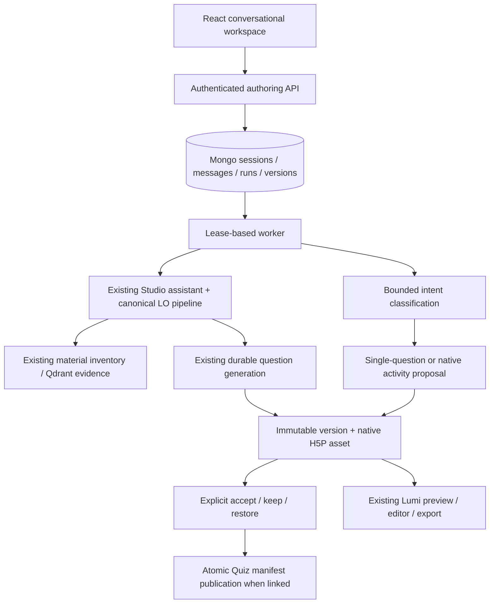

# H5P Studio conversational authoring — implementation

2026-09-28. Earlier design: `studio-agentic-authoring-architecture-2026-09-26.md`.

## How to use it now

Open H5P Studio → **Create with AI**. The new entry point is a session workspace: conversation and decisions on the left; teaching plan, real H5P preview, questions, and sources on the right. Colors, typography, buttons, and sidebar follow CREATE's existing design. On mobile, the panes stack vertically.

1. Select or create a course, upload PDF/DOCX files, or select existing course materials. A prompt is optional.
2. The system waits for material processing and reuses existing learning objectives. When none exist, it runs the course's material inventory, coverage repair, and objective-generation pipeline, then creates a question plan.
3. By default, the user confirms **Accept plan & generate**. They may edit objectives and question counts or adjust the plan in chat first. After selecting **Generate draft automatically**, the system may execute a suggested plan directly.
4. After generation, preview and download the H5P activity. The user can continue chatting, request a specific question revision or a revision of the full native activity, accept or reject proposals, and restore earlier versions.
5. **Advanced types** retains the old native AI composer; **Advanced editor** retains the official H5P editor. Initial course generation in the new entry point currently uses Column.

## How the system works

This is a constrained authoring harness in the existing Express process, built on existing services. It adds no second microservice, mandatory Redis dependency, or new agent framework.



An ordinary chat message first produces a structured action: `reply`, `revise_plan`, `revise_question`, or `revise_activity`. The server validates the action and question number before calling predefined services. The model cannot run shell commands, query the database arbitrarily, read materials from another course, approve proposals, or publish externally.

Initial generation reuses `studioAssistantService` and existing question jobs. Single-question revisions retrieve evidence from selected materials and reuse question generation, type conversion, and model validation. Whole native-activity revisions reuse generation and validation against installed H5P semantics.

## Session, run, and version storage

| Collection / field | Contents | Purpose |
| --- | --- | --- |
| `StudioAuthoringSession` | Owner, course/materials/Quiz, current and proposed versions, current run, revision | Reopenable work and concurrent-decision boundary |
| `StudioAuthoringMessage` | User and assistant messages | Server-side conversation, separate from audit logs |
| `StudioAuthoringRun` | Request ID/hash, action input, lease, checkpoints, saved model output | Command idempotency, recovery, and explicit retry |
| `StudioAuthoringVersion` | Parent, restoration source, course snapshot, native content ID, change summary | History; proposals do not immediately replace the current version |
| `H5PContent.authoringSessionId / authoringOperation` | Version ownership, package receipt | Prevent duplicate package writes and direct deletion of historical content |
| `Quiz.authoringCommitId` | Published version identifier | Confirm a successful Quiz publication after a response is lost |

Sessions, messages, and snapshots are private authoring content governed by the current user's and course's ownership, not telemetry. The browser keeps only the opaque request ID for an initial submission. After refresh, the URL and Task history retrieve server state. The UI currently returns the latest 100 messages, 100 versions, and 50 runs. Older records remain in the database; history pagination and automatic archival/deletion are not implemented.

Progress uses bounded polling: about 1.8 seconds for active work and 8 seconds for completed work. The backend worker checks runs every 2 seconds. The workspace adds no new SSE protocol; existing course generation keeps its current mechanism.

## Recovery and tool-call boundaries

- Every mutation uses a request ID and request digest. Resending the same command does not start duplicate work; reusing an ID with different content is rejected.
- A Mongo lease lasts 90 seconds and renews during execution. Each Express process runs at most three authoring runs, with a 20-minute budget per run. Subtasks retain the existing Studio and question-job budgets.
- Intent classification sees only the latest 12 messages, the current plan, and necessary question summaries. It does not receive general database access.
- Intent results, generated question/native parameters, and packaging are separate steps. If model output was saved but packaging failed, an explicit retry can reuse the output.
- After server restart, safe wait, publication, and package checkpoints can resume. An uncertain model call is marked interrupted and is not automatically repeated at additional cost.
- **Stop task** requests cancellation. Service boundaries verify that a run is still valid before writing. Completed stages and versions remain. The underlying model provider may not support immediate termination of a request already in flight.
- Mutations through the new entry point are limited to 20 per user per minute. This is not a token-spend cap. Provider costs, global concurrency, and operational alerts still use existing configuration and need refinement for larger deployments.

## Version and rollback semantics

**course-linked** versions save course objectives, questions, settings/blueprint, chapters, and a native H5P snapshot. Accepting a single-question revision or restoring such a version first stages complete LO/Question records, validates them again, then updates the Quiz reference manifest once under the existing question-mutation lease. Old records and native content are not overwritten.

Before publication, compare a course-content fingerprint covering the settings, materials, objectives, questions, and chapters that would be replaced. Changes made from another page block replacement. A single-question revision changes only the selected question, preserving the others and existing plan/novelty metadata.

**native-fork** versions save independent native H5P content. Whole-activity native revisions and saves from the official editor create this kind of version; they are not presented as reversible normalized Questions. Accepting or restoring them does not change the course question bank or coverage map.

Manual editor saves copy content to a new content ID. Lumi's copy mechanism preserves existing media references, and the save path verifies media paths afterward. Ordinary content deletion cannot delete historical versions. Downloads use the latest content ID returned by save.

Rollback creates a new version from an older accepted version. It does not erase intervening history or undo content already downloaded or deployed externally.

## Key files

- `src/components/h5p/authoring/AuthoringWorkspace.tsx`: Session UI, material selection, decision cards, preview, and version history.
- `src/styles/pages/StudioAuthoring.css`: Desktop and mobile layout.
- `src/pages/H5PStudio.tsx`: New Create with AI entry point and links to advanced editing.
- `routes/create/controllers/authoringController.js`: Authentication, read/write API, and rate limits.
- `routes/create/models/StudioAuthoring.js`: Four persistent models and indexes.
- `routes/create/services/authoring/authoringService.js`: State machine, leases, action dispatch, and recovery.
- `routes/create/services/authoring/artifactVersionService.js`: Version packaging, course publication, restoration, and manual saves.
- `routes/create/services/authoring/courseObjectiveService.js`: Adapter for the existing high-quality objective pipeline.
- `docs/help/h5p-studio.md`: User workflow, limits, and failure recovery.

## Verification and runtime

No new environment variables are required. The feature uses existing Mongo, material/RAG, model configuration, and Lumi storage. The authoring worker starts with the backend; model indexes are initialized on first use. Deployment requires database-index creation permission, and multiple instances still need shared persistent H5P file storage.

```bash
npm run dev
npm run build
npm exec vitest -- run src/components/h5p/authoring/AuthoringWorkspace.test.tsx src/pages/H5PStudio.test.tsx src/components/h5p/StudioAssistant.test.tsx
npx playwright test --config playwright.authoring.config.ts
cd routes/create
NODE_OPTIONS=--experimental-vm-modules npx jest --config jest.authoring.config.js --runInBand
NODE_OPTIONS=--experimental-vm-modules npx jest --selectProjects isolated --runInBand --runTestsByPath __tests__/integration/studioAssistantService.test.js
NODE_OPTIONS=--experimental-vm-modules npx jest --selectProjects unit --runInBand --runTestsByPath __tests__/unit/courseObjectiveService.test.js __tests__/unit/helpKnowledgeService.test.js __tests__/unit/studioAssistantPlanning.test.js __tests__/unit/h5pEditorService.test.js
```

Mongo integration tests use a new random QA database on localhost and delete it afterward; model calls use fixtures. Playwright uses deterministic HTTP fixtures to check the real page's desktop/mobile layouts, plan confirmation, and version comparison. It is not a real paid-model generation evaluation. Real Lumi tests use a separate temporary directory to verify native saves, preview HTML, and standard H5P package export.

The production build and 208 targeted tests passed (143 unit, 26 backend integration, 36 frontend, and 3 browser tests). Full TypeScript checking was not a green baseline: the repository lacked declared/installed React type packages and emitted a TypeScript 6 `baseUrl` deprecation warning. Ignoring that warning still left project-wide JSX type errors. Existing dependency configuration was not changed to hide those issues.

## Boundaries of this release and the longer-term design

This release delivers a complete first path for H5P creation, conversational adjustment, explicit decisions, server-side sessions, and version restoration. The longer-term design's general multi-agent scheduler, LangGraph integration, fine-grained native patches for every content type, history pagination, complete semantic diffs, model-cost dashboard, and history cleanup policy are not implemented.

Initial automatic generation is limited to Column types supported by the existing course assistant and at most 20 new questions. Broader native types remain available through Advanced types. Plan changes in chat adjust the question plan while retaining objectives; objective wording is edited through fields. The new UI's change summaries and preview switches are not field-by-field native diffs.

If a separate worker or LangGraph becomes necessary, retain the current tool boundaries, idempotency receipts, explicit decisions, and version model while replacing only the execution scheduler. Do not grant database write authority to arbitrary model text.

## Quality-failure and recovery fixes on 2026-09-28

Studio plan expansion adds single-question scope to each generation request while retaining the source row's evidence, intent, and constraints. Wrapper instructions stay consistent within a row so planned-slice grouping remains intact. The planner places quantities in `count` and describes a single-question task in each row. Multiple-choice feedback review also checks one question and its specified slice; the application validates batch size.

Quality-failure receipts now use allowlisted reasons distinguishing answer, instruction, feedback, review-unavailable, and invalid-review failures. The UI displays a safe description by question number. Raw model errors and source material are excluded from diagnostics.

When a user explicitly selects **Resume task**, a new receipt may copy ready candidate questions from the failed receipt into a new generation job and skip those model calls. The original receipt is unchanged. The owner, Quiz, request configuration hash, course version, question revision, and original question IDs must all match. Missing candidates are regenerated; if an old generation contract is incompatible, the whole batch is regenerated. Publication occurs only after all questions are ready, under existing lease and version fences. Replaying the same request ID cannot publish twice.

After a frontend session or material refresh fails, it retries reading every 8 seconds without replaying paid commands. A separate `refreshError` keeps read errors from overwriting mutation errors.

Targeted verification for this pass: 178 backend unit tests, 96 MongoDB integration tests, and 31 frontend tests passed; TypeScript (with the TS6 deprecation warning ignored) and the production build passed. For real-model retests and remaining limits, see "Fixes and real-model retest" in `docs/reports/gpt-6-luna-test-2026-09-28.html`.
