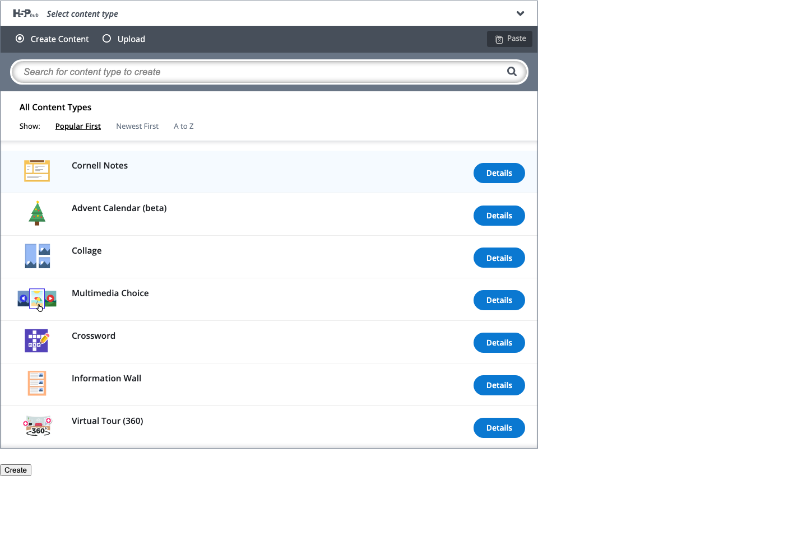

# H5P Studio 扩充与维护 skill 验证记录 — 2026-09-28

已在当前代码库安装缺少的 19 种内容类型，覆盖 [H5P.org 公开展示页](https://h5p.org/content-types-and-applications) 的 54 种目标类型。这里的类型包括题目、媒体活动和课程容器。原有 Audio 是额外类型，因此官方编辑器共有 **55 种可选类型**。已退役的 Twitter User Feed 继续排除。

## 改动范围

- 保持 H5P Core API 1.28；没有伪造或降低任何库的 coreApi 要求。
- 本次安装/升级 64 个库目录（50 个新增目录、14 个已有目录补丁更新），包含运行库和编辑器依赖。保留已有 minor 版本目录，不自动迁移教师已保存的内容。
- 新增 19 种类型标记为 `manual`，出现在 **H5P Studio → New blank activity** 的官方选择器中；不自动开放其 AI 生成，也不扩充 CREATE 常规题型矩阵。
- `h5p-studio-targets.json` 记录目标范围；运行清单与 lock 记录实际来源、构建信息和文件哈希。
- 没有实现在线更新管理系统。维护通过可引用的 skill 和仓库脚本完成。

## 新增类型及版本

| 官方编辑器显示名称 | Machine name | 安装版本 |
| --- | --- | --- |
| Advent Calendar (beta) | `H5P.AdventCalendar` | 0.3.4 |
| AR Scavenger (beta) | `H5P.ARScavenger` | 1.4.1 |
| Cornell Notes | `H5P.Cornell` | 0.3.2 |
| Find Multiple Hotspots | `H5P.ImageMultipleHotspotQuestion` | 1.0.1 |
| Find The Words | `H5P.FindTheWords` | 1.4.4 |
| Flashcards | `H5P.Flashcards` | 1.7.23 |
| Game Map | `H5P.GameMap` | 1.5.4 |
| Image Juxtaposition | `H5P.ImageJuxtaposition` | 1.5.4 |
| Image Pair | `H5P.ImagePair` | 1.4.0 |
| Image Sequencing | `H5P.ImageSequencing` | 1.1.0 |
| Impressive Presentation | `H5P.ImpressPresentation` | 1.0.3 |
| Information Wall | `H5P.InfoWall` | 0.4.9 |
| KewAr Code | `H5P.KewArCode` | 1.2.2 |
| Personality Quiz | `H5P.PersonalityQuiz` | 1.0.8 |
| Speak the Words | `H5P.SpeakTheWords` | 1.5.7 |
| Speak the Words Set | `H5P.SpeakTheWordsSet` | 1.3.4 |
| Structure Strip | `H5P.StructureStrip` | 1.0.6 |
| Virtual Tour (360) | `H5P.ThreeImage` | 0.5.8 |
| Advanced Fill in the Blanks | `H5P.AdvancedBlanks` | 1.4.0 |

## 遇到的问题与处理

1. **名称与库名不一致。** Virtual Tour 对应 `H5P.ThreeImage`，Cornell Notes 对应 `H5P.Cornell`；按官方 registry 映射定位，避免误判为不存在。
2. **Impressive Presentation 无法通过 Hub 下载。** 从[官方示例页](https://h5p.org/impressive-presentation)实际提供的 `.h5p` 导出获取 1.0.3 和匹配编辑器。上游标为实验性类型，建议 Chrome，不能把表单通过解释为跨浏览器稳定性保证。
3. **AdvancedBlanks 的 Hub 和示例包均不可用。** 从原作者 NDLANO 的两个仓库固定源码构建。运行库提交 `9bd77ac4b2140a9b1b08d3393398a6fdf1e52ecc`，编辑器提交 `270b587c88a2275e899cbeedcc616b7bde5a12e7`。这是未打 release tag 的源码快照；Node 22.22.3，使用上游 lockfile，安装时禁用 lifecycle scripts，再执行已检查的构建命令。没有将源码构建标成 Hub 正式发行版。
4. **共享依赖连带升级。** 仅合入更高补丁或新增目录；对既有题型执行回归和浏览器表单检查。
5. **验证服务器错误。** 初次大量 `action=libraries` 400 来源于独立测试服务器的 URL-encoded 数组解析设置。改成与 CREATE 一致的 `extended: true` 后消失，没有修改生产接口来掩盖测试问题。
6. **保留的旧版本缺资源。** 工作区原有 Crossword 0.4、Dictation 1.4、InteractiveBook 1.13 缺少编译 bundle；本次未新增这些缺陷。Studio 分别选择完整的 0.5、1.3、1.11。回归检查覆盖实际被选择的版本及完整依赖闭包，不声称每个保留的历史目录都可运行。
7. **上游空白格式。** `git diff --check` 对新导入的部分上游 CSS/JS 报告尾随空白。保留来源内容，未为格式问题重写 vendored bundles；项目自有代码的 diff 检查通过。所有安装文件（包括嵌套 dist）均未被 gitignore 排除。
8. **三个上游包缺图标。** Find Multiple Hotspots、Impressive Presentation、Personality Quiz 的原始包没有 `icon.svg`，原生选择器因此显示灰色 H5P 占位图。为三个库加入 CREATE 自制 SVG 图标，将每个文件记录为 `createPatches` 并更新运行清单及 lock 哈希；浏览器验证三个图标均从本地地址加载并显示。
9. **自动填表的事件差异。** 在真实 Studio 页面上，浏览器自动化的 `fill()` 能让输入框显示文本，却没有触发该 H5P 文本组件依赖的原生 `change` 事件；标题未同步到 Metadata，保存会显示“参数无效”。用真实键盘输入并离开字段后，标题同步，内容正常保存。验收脚本中的预填参数测试与真人逐字输入应分别标记，不能把“输入框可见”当作持久化成功。
10. **嵌套编辑器需要就绪时间。** Speak the Words Set 的子题编辑器初始化晚于外层表单。浏览器测试在内层加载完成后保存、重开成功；过早调用表单验证会给出误报。Information Wall 的自定义编辑器也不能在表单尚未准备好时强制运行验证。

完整可复用处理方式见 [skill 排错记录](../../skills/create-h5p-maintenance/references/troubleshooting.md)（仓库路径为 `skills/create-h5p-maintenance/references/troubleshooting.md`）。

## 验证结果

| 检查 | 结果与范围 |
| --- | --- |
| 实际 native picker | 54/54 目标都在普通作者可用列表中；包含 Audio 共 55 种 |
| Chromium 官方编辑器 | 54/54 空白表单打开，依赖加载完成，存在表单控件，无浏览器异常或本地 HTTP 400/404/500 |
| 三个图标 | 3/3 本地 `icon.svg` 在 Chromium 选择器中加载并可见；图标测试与截图已加入 `verify-editor.mjs` |
| 新增类型的原生浏览器保存 | 19/19 使用合成的、预填的有效内容参数，并在每个官方表单里用键盘改写标题，经表单按钮提交到隔离存储，重新读取时确认标题与库均正确；这不是 19 种逐字段手工编写真实课程内容的证明 |
| 真实 CREATE 页面手动操作 | 在登录的 Studio 里用键盘创建 Flashcards，保存、刷新重开并预览；题目“Closest star to Earth?”和答案“The Sun”持久化，预览作答显示正确 |
| H5P 后端回归 | 16 个 suite，163 项通过，含 19 个新类型的 AI 拒绝边界、资源闭包和普通作者目录检查 |
| CREATE Guide 检索 | 86 项通过，包含新类型/手动编辑检索 |
| 维护工具安全回归 | 16 项通过，含路径穿越、依赖/核心要求、篡改候选及过期基线拒绝 |
| 文件 lock | 无漂移，无新增完整性缺陷 |
| 前端生产构建 | `npm run build` 成功；已有大 bundle 提示仍在 |
| skill 格式 | `quick_validate.py` 通过 |
| skill 实际演练 | 隔离目录移除 Flashcards → prepare → apply → lock 验证成功；同包再次 prepare 为零改动 |

浏览器验证使用真实 CREATE Lumi 配置、官方 JS/CSS、原生 AJAX router 和普通作者权限；采用独立临时内容目录与随机 localhost 端口，未修改教师数据或现有运行服务。远程 Hub 缓存置空，以验证已安装类型不依赖 Hub 在线。使用与 Studio 相同的官方编辑器模型；不是一次完整的带登录 React 页面端到端验收。

**验证边界：**19/19 的保存、重开测试在官方表单中用键盘输入标题，其余内容参数由合成夹具预填；只有 Flashcards 在用户登录的 CREATE 页面逐字段键入并完成一次预览作答。没有逐项完成 54 种真实教学内容的手工录入，也没有验证其余类型的学习者作答评分、设备麦克风/摄像头、外部 API 或 Canvas 部署。语音、AR、媒体与实验性内容仍需实际内容验收。旧内容没有批量升级。

证据文件：[完整类型与版本](h5p-studio-expansion-2026-09-28/catalog.json)、[逐项浏览器结果](h5p-studio-expansion-2026-09-28/editor-acceptance.json)、[19 种保存重开结果](h5p-studio-expansion-2026-09-28/manual-save-acceptance.json)、[真实 Studio 操作记录](h5p-studio-expansion-2026-09-28/live-studio-flashcards.json)、[skill 演练](h5p-studio-expansion-2026-09-28/skill-validation.json)。实际 Studio QA 活动：`http://localhost:8092/h5p-studio?contentId=1159879311`（仅当前本地实例和登录账号可访问）。

## 如何使用

当前代码库：刷新 Studio，打开 **New blank activity**，搜索需要的类型。部署环境需部署这些代码和全部库资源，并重启后端后再刷新编辑器。

仓库里的可移植 skill 位于 `skills/create-h5p-maintenance/`，本机也安装到了 Codex skills 目录。其他用户把整个目录安装到自己的 Codex skills 后，可以请求：

> 使用 $create-h5p-maintenance 检查这个 CREATE 仓库的 H5P 类型和版本，更新兼容的库，验证官方编辑器，并记录问题与结果。

也可以在当前仓库直接引用其 `SKILL.md`。新安装的 skill 若尚未出现在当前聊天的可选列表，可在新聊天中引用。它会指导 agent 执行检查、安装和验证；不是无人值守的后台自动更新服务。遇到较高核心版本要求或不可获得的源码，必须报告具体阻塞，不能以凑够数量作为完成依据。
